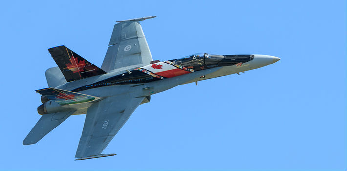

#### Maple Muscle at the Beck and Call of Military Allies

[Yaël Ossowski](http://panampost.com/author/yael-ossowski/) | [PanAm Post](http://panampost.com/yael-ossowski/2015/01/22/about-face-canadas-shift-from-peacekeeper-to-bomb-dropper/) January 22, 2015

_Canada’s reputation as a peacekeeping nation has drastically changed in the last decade. ([Gopixpic](http://www.gopixpic.com/1024/canada-air-force-15003-aircraft-at-toronto-pearson-int-on-photo/http:%7C%7Cwww*airplane-pictures*net%7Cimages%7Cuploaded-images%7C2009-3%7C15%7C39523*jpg/))_

“Canadians want to live in peace,” declared [Prime Minister John Diefenbaker](https://www.collectionscanada.gc.ca/primeministers/h4-4052-e.html) to the nation in 1960 in the midst of the ongoing Cold War.

Those were difficult times. The United States and the Soviet Union were divvying up the world and expanding their influence. Proxy conflicts, spy games, sanctions, and the threat of nuclear war reverberated in headlines across the world.

Yet, despite the pressure from its southern neighbor, Canada kept a cool head and stood firm in its commitment for peace. It avoided the pitfalls of the Vietnam War, struck a [friendly relationship with Cuba](http://panampost.com/yael-ossowski/2014/01/14/one-million-canadians-cuba-every-year-us-citizens/) instead of signing onto the US embargo, and deployed [thousands of peacekeepers](http://www.canadainternational.gc.ca/prmny-mponu/canada_un-canada_onu/positions-orientations/peace-paix/peace-operations-paix.aspx?lang=eng) to United Nations missions in the Suez Canal, Congo, Syria, and elsewhere.

Now, 50 years later, even after avoiding so many disastrous wars throughout the decades, Canada finds itself [strategically bombing pieces](http://www.cbc.ca/news/politics/canada-s-isis-bomb-attack-destroyed-heavy-engineering-equipment-1.2823458) of the Iraq held by the Islamic State. Ironically, Canada was reluctant to lend soldiers and bombs to the first effort led by the United States in 2003. Now it’s taking center stage and flexing its bombing muscle.

_Hundreds of thousands of Canadian peacekeeping forces have been deployed over the globe in the last 50 years. ([United Nations](http://www.un.org/en/events/peacekeepersday/2008/photos2/dest4/pages/canadianSoldier.shtml))_

It’s a far cry from the “peacekeepers first” mentality formed by nearly five decades of Canadian foreign policy.

Canada’s [UN mission website](http://www.canadainternational.gc.ca/prmny-mponu/canada_un-canada_onu/positions-orientations/peace-paix/peace-operations-paix.aspx?lang=eng) boasts that “to date, over 125,000 Canadians have served in close to 50 UN missions.”

One of the most notorious was the mission in genocide-era Rwanda, headed up by Canadian General Roméo Dallaire from 1993-94. Since that time, however, Canada has slowly shed its peacekeeping prowess for a more dirty role in world affairs.

According to the United Nations, Canada has [substantially dropped](http://www.un.org/en/peacekeeping/resources/statistics/contributors.shtml) its number of peacekeepers deployed from the high of 3,336 in 1993 to just 113 today, mostly as military police in war zones across the African continent. In the last decade alone, that number has flatlined.

In the era of Canadian muscle, the military, not the peacekeepers, receives the first call.

Such was the case for [Operation Athena](http://www.forces.gc.ca/en/operations-abroad-past/op-athena.page), Canada’s support mission for NATO in its occupation of Afghanistan. It began with [a few dozen Special Forces commandos](http://www.thestar.com/news/canada/2010/04/25/canadas_elite_commandos_and_the_invasion_of_afghanistan.html) in 2001, and expanded to thousands of Canadian soldiers [governing the entire provinces](http://www.forces.gc.ca/en/operations-abroad-past/op-athena.page) of Kandahar and Helmand from 2003 until the withdrawal of combat troops in 2011.

The last Canadian soldiers returned home from Afghanistan in March 2014, after nearly three years of an “advisory and training role,” according to the [Conservative government](http://canadafreepress.com/index.php/article/statement-by-the-prime-minister-of-canada-on-the-lowering-of-the-canadian-f) of Prime Minister Stephen Harper.

_The Canadian military served a major role in the Afghanistan War from 2001-2011. ([Canadian Armed Forces](http://www.forces.ca/en/home/))_

It wasn’t six months before Canada’s military was fueling up the jets yet again for another Middle Eastern intervention, this time in Iraq.

Starting in November 2014, the Canadian effort to bomb parts of Iraqi territory held by the fanatical jihadi Islamic State, named [Operation IMPACT](http://www.forces.gc.ca/en/operations-abroad-current/op-impact-airstrikes.page), was meant to be a 30-day mission limited to aerial bombing. Unsurprisingly, it’s gone beyond that.

[Shots fired last week](http://www.cbc.ca/news/politics/isis-fight-canadian-special-forces-returned-fire-in-last-week-1.2917777) between Islamic State fighters and Canadian special forces on the ground in Iraq are likely to only further entrench Canada in this bewildering mission to bomb the enemies of Canada’s declared enemy, Syrian President Bashar al-Assad.

“Canada has stood, and continues to stand, with the people of Syria in their struggle for freedom and democracy against the tyrannical and murderous regime of Bashar al-Assad,” said Foreign Minister John Baird in September 2013.

Just a year later, Canada was giving air support to the very people aiming to overthrow Assad’s regime.

When the government was questioned on the extent, length, and precise aim of the bombing campaign in Iraq by Thomas Muclair, the leader of the opposition for the New Democratic Party, in September, Parliamentary Secretary Paul Calandra responded with a [bizarre statement](http://globalnews.ca/news/1579059/ndp-leader-tom-mulcair-questions-speakers-neutrality/) about Israel’s fight with terrorism.

_Canadian Foreign Secretary John Baird has brought Canada’s foreign policy very close to that of the United States. ([US Department of State](http://www.state.gov/))_

“Mr. Speaker, does the leader of the opposition not understand that our friends in Israel are on the front lines combating terrorism,” said Calandra, [not once but twice](http://www.cbc.ca/thecurrent/episode/2014/09/25/ndp-leader-tom-mulcair-questio/) in response to the [opposition’s questions](http://www.cbc.ca/news/politics/paul-calandra-apologizes-for-non-answers-as-sources-pin-blame-on-pmo-1.2779046).

These are puzzling times.

Canadians can safely ask themselves: how exactly did we get here?

Some could say it was the rise of jihadi terrorism threatened against the Canadian people.

But let’s be frank: Canada’s problems with radical Islamic terrorism began when it deployed its first soldier to support the NATO mission of invading Afghanistan. And it’s only gotten worse with Canada’s involvement in bombing Iraq to drive out ISIS and friends.

That’s exactly what law enforcement authorities discovered in their investigations into attempted terrorist attacks on Canadian soil and exactly what the alleged perpetrators confessed either before their actions or in court.

The deranged man who killed one person and injured three on Parliament Hill last October was driven by “[Canada’s foreign policy](http://www.therecord.com/news-story/4946984-religion-foreign-policy-formed-basis-for-zehaf-bibeau-s-attack-paulson/),” said Royal Canadian Mounted Police Commissioner Bob Paulson. The man who ran down and killed a Canadian soldier just two days prior was “really mad that Canada actually supported the American bombing of \[ISIS\] in Syria and Iraq,” [according to his friends](http://www.cbc.ca/news/canada/who-is-martin-couture-rouleau-1.2807285). And [on](http://www.ipolitics.ca/2014/10/14/meet-canadas-new-ally-bashar-assad/), and [on](http://newyork.cbslocal.com/2013/05/09/tunisian-man-charged-in-new-york-terror-cell-plot/).

It’s created a vicious circle whereby the actions of the government, mainly foreign interventions in Afghanistan and Iraq, have driven radical Islamists to commit acts of terror against ordinary Canadians at home, providing the pretext for [crippling anti-terror laws](http://panampost.com/yael-ossowski/2014/12/18/canada-dont-be-duped-into-us-style-anti-terrorism-laws/) which limit free speech and indemnify and embolden Canada’s security services.

Instead of responding to conflicts in the Middle East with reasoned conflict-resolution, Canada has resorted to pulling the big punches and serving up support to its allies of the United States and Great Britain.

Canada has abandoned its reputation as world’s top peacekeeper for more muscular foreign policy, creating even more enemies abroad and at home.

_Canadian soldiers first arrived in Afghanistan in 2001. ([WikiMedia](http://upload.wikimedia.org/wikipedia/commons/b/b5/Canadian_soldiers_afghanistan.jpg))_

Why have we been brought here?

One could look to Canada’s booming defense industry for some indication.

From 2012-13, the top 20 Canadian defense manufacturers made over US$2.1 billion in contracts with both the Canadian and US Departments of Defense, according to [Project Ploughshare](http://ploughshares.ca/wp-content/uploads/2013/12/Largest-Canadian-Military-Prime-Contractors-2012.pdf), a Canadian nonprofit dedicated to recording wartime spending. That’s enough to fill the gap of Canada’s annual budget deficit.

A consistent need to equip our soldiers and Canada’s allies abroad with gear keeps the wartime economy afloat. It’s one theory.

Regardless of the reason, Canada is knee-deep in war and conflict with no end in sight.

Canadians, much like Diefenbaker said in 1960, want peace. It’s time the people remind their government of this fact.
