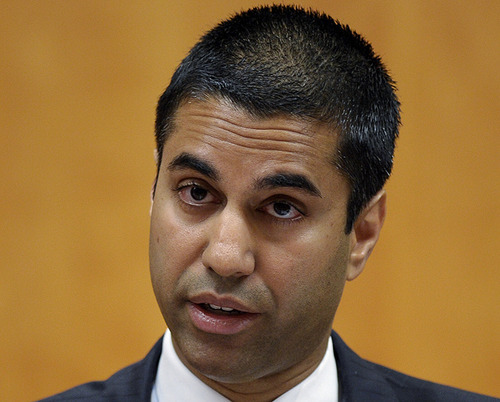

By [Yaël Ossowski](http://watchdog.org/author/yael/ "Posts by Yaël Ossowski")  / February 9, 2015 / [Watchdog.org](http://watchdog.org/198563/fcc-commissioner/)

After years of dithering, Federal Communications Commission Chairman Tom Wheeler has at last deposited the formal proposal to reclassify Internet as a public utility and subject it to federal regulation, championed by proponents as “net neutrality.”

Wheeler outlined the plan in an article for Wired magazine [last week](http://www.wired.com/2015/02/fcc-chairman-wheeler-net-neutrality/) and it will be considered for a vote by the commission Feb. 26.

The plan has not yet been released to the public, but at least one FCC commissioner who has seen it isn’t taking the bait.

“It gives the FCC the power to micromanage virtually every aspect of how the Internet works,” said FCC Commissioner Ajit Pai [in a statement](https://apps.fcc.gov/edocs_public/attachmatch/DOC-331907A1.pdf) after the plan’s release. “It’s no wonder that net neutrality proponents are already bragging that it will turn the FCC into the “Department of the Internet.”

“For that reason, if you like dealing with the IRS, you are going to love the President’s plan,” said Pai.

He also criticized Wheeler for not making the proposal publicly available on the FCC’s website.

The 332-page proposal, if adopted by the five-member commission, will give the FCC the ability to ban certain Internet access plans and regulate Internet service providers to ensure it remains “fast, fair and open,” according to Wheeler.

“These enforceable, bright-line rules will ban paid prioritization, and the blocking and throttling of lawful content and services,” wrote Wheeler on [Wired.com](http://www.wired.com/2015/02/fcc-chairman-wheeler-net-neutrality/). “This means the action we take will be strong enough and flexible enough not only to deal with the realities of today, but also to establish ground rules for the as yet unimagined.”

Though all five members of the commission were appointed by President Barack Obama, at least two were nominated by Republicans, most likely guaranteeing a 3-2 vote at the end of this month.

The partisan pursuit of adopting this plan has enraged several [top-name Democrats](http://www.usatoday.com/story/opinion/2015/02/06/fcc-technology-net-neutrality-technology-congress-washington-column/22762691/) who now head the [Internet Innovation Alliance](http://www.internetinnovation.org/press-room/broadband-news-press-releases), a nonprofit organization aimed towards universal broadband access for Americans.

They penned an [op-ed in USAToday](http://www.usatoday.com/story/opinion/2015/02/06/fcc-technology-net-neutrality-technology-congress-washington-column/22762691/) over the weekend calling on the FCC to scrap the plan and start all over, claiming Wheeler has proposed “regulating our most advanced companies based on the rules designed for our oldest,” and that he must work with all parties to make certain Internet consumers are not harmed by rampant government legislation.

“A better way to preserve the open Internet, protect consumers and promote innovation is to encourage the private investment necessary to support the deployment of high-speed, next-generation broadband nationwide,” said former Democratic Congressman Rick Boucher, chairman of the group, in a [statement](http://www.internetinnovation.org/press-room/broadband-news-press-releases) following the announcement of Wheeler’s proposal.

“For more than two decades, from the earliest days of the Internet, I along with most Democrats involved in development of our nation’s Internet policy, have advocated a light regulatory touch for the Internet,” added IIA founder Larry Iriving, former assistant commerce secretary under President Bill Clinton. “I still believe that to be preferable to utility-style regulation for the fast-moving and constantly evolving Internet.”

As a member of the FCC commission, Pai sees the plan as especially harmful to the small innovators [so often championed](http://watchdog.org/196422/net-neutrality-cat-memes/) by proponents of net neutrality.

“The plan saddles small, independent businesses and entrepreneurs with heavy-handed regulations that will push them out of the market,” said Pai. “As a result, Americans will have fewer broadband choices. This is no accident. Title II was designed to regulate a monopoly. If we impose that model on a vibrant broadband marketplace, a highly regulated monopoly is what we’ll get.”
