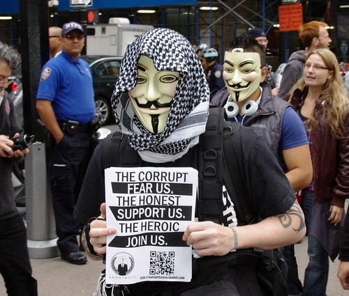
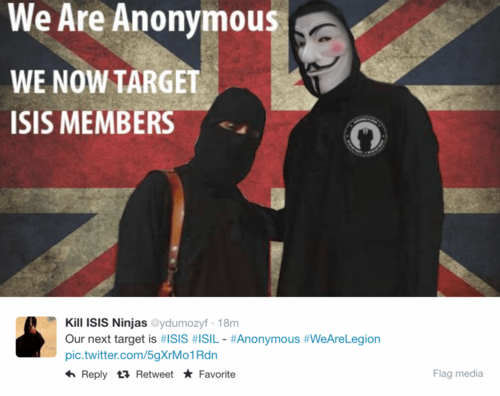

By [Yaël Ossowski](http://watchdog.org/author/yael/ "Posts by Yaël Ossowski") / February 11, 2015 / [Watchdog.org](http://watchdog.org/198867/anonymous-isis/)

The hacking collective Anonymous is on the [offensive yet again](http://pastebin.com/d8ND4rvV), striking the Islamic State’s many proactive social media users who use sites such as Twitter and Facebook to recruit for jihad terrorism.

In a [series of posts](http://pastebin.com/UqmnG2Wr) on the [website Pastebin](http://pastebin.com/d8ND4rvV) over the weekend, purported members of Anonymous [vow to continue](http://www.youtube.com/watch?v=_kJtvFUMELM) “Operation Ice ISIS,” taking down websites and social media accounts of groups who assist in terrorist activities.

This new round of online attacks is meant to target individuals who are directly involved with planning and recruiting for attacks against civilians in Iraq and Syria.

“We will hunt you, take down your sites, accounts, emails, and expose you,” said the group in a [YouTube video](http://www.youtube.com/watch?v=BPE_sRhZp6M) released over the weekend. “From now on, no safe place for you online…you will be treated like a virus, and we are the cure.” The post goes on to list hundreds of links to social media accounts in Arabic, classifying them by their “priority” status.

By standard analysis, these may be thought of as idle threats, but a cursory glance at the list reveals that most, if not all, the Twitter and Facebook accounts mentioned by Anonymous have indeed been suspended.

_FOCUSED: The hacking collective Anonymous is using its effort to combat the rise of the ISIS fighters in the Middle East._

Added to the fact, Anonymous hackivists have [claimed responsibility](http://cjlab.memri.org/lab-projects/monitoring-jihadi-and-hacktivist-activity/anonymous-announces-operation-no2isis-says-it-will-attack-qatar-turkey-and-saudi-arabia-and-assault-american-virtual-government-infrastructure/) for similar attacks against the governments of Qatar, Saudi Arabia and Turkey, who they claim have been [funneling millions of dollars](http://www.youtube.com/watch?v=_kJtvFUMELM) into ISIS extremists in the last year. That has been alleged by many [British](http://www.telegraph.co.uk/news/worldnews/middleeast/iraq/11140860/Qatar-and-Saudi-Arabia-have-ignited-time-bomb-by-funding-global-spread-of-radical-Islam.html) and American military sources, but still [outright denied](http://www.thedailybeast.com/articles/2014/06/14/america-s-allies-are-funding-isis.html) by the countries in question.

In targeting the social media outreach of ISIS, Anonymous has effectively hampered its number one recruiting tool, [according to the Middle East Media Research Institute](http://www.memritv.org/subject/en/63.htm), which studies jihadists’ web postings. This will limit the group’s abilities to reach out to followers and continue amassing support from sympathizers across the world, including those who [commit lone wolf acts of terror](http://www.thedailybeast.com/articles/2014/10/24/in-canada-the-stray-dogs-of-isis.html) in the west.

And by attacking the Islamic terror group at its central nervous system, that of social media, Anonymous has dealt a more devastating blow to ISIS than the 21 countries currently spending millions of dollars dropping bombs and stationing troops in parts of Iraq and Syria could ever hope to do. Where the military strategists are lacking, the computer hackivists are gaining ground.

While it doesn’t necessarily negate the notion of military strategy to defeat groups or armies who commit mass violence, it surely provides a different model that governments would be wise to adopt if they want to defeat the enemies of tomorrow.

Though the bombing campaign has killed over 6,000 ISIS fighters, [according to U.S. Ambassador to Iraq Stuart Jones](http://english.alarabiya.net/en/News/middle-east/2015/01/22/Air-strikes-killed-6-000-ISIS-fighters-U-S-ambassador.html), it has only incited more committed jihadists to join the cause. The small band of thousands of rebels initially opposed to Syrian President Bashir al-Assad have now swelled to over 200,000 fighters with a much larger goal in mind, [according to the Iraqi Kurdistan chief of staff](http://watchdog.org/198867/anonymous-isis/www.el-balad.com/1247637), including increasingly more fighters from western states.

Oddly enough, it was these fighters who were [given tacit support](http://www.theatlantic.com/international/archive/2014/06/isis-saudi-arabia-iraq-syria-bandar/373181/) last year by the U.S. government and allies to help ouster al-Assad and overthrow his regime.

_DEVASTATE: An American F22 flies over Syria to drop bombs on select ISIS targets._

President Barack Obama is slated to ask Congress in the coming days for a war time authorization in order to continue bombing ISIS, according to [Reuters](http://www.reuters.com/article/2015/02/10/us-mideast-crisis-congress-idUSKBN0LD29U20150210), at last putting the nearly eight-month military campaign to a vote by the people’s representatives.

Obama previously vowed to “degrade and ultimately defeat ISIL through a comprehensive and sustained counterterrorism strategy,” according to a [Nov. 2014 letter he wrote to House Speaker John Boehner,](http://www.google.com/url?sa=t&rct=j&q=&esrc=s&source=web&cd=2&cad=rja&uact=8&ved=0CCcQFjAB&url=http%3A%2F%2Fwww.whitehouse.gov%2Fsites%2Fdefault%2Ffiles%2Fomb%2Fassets%2Fbudget_amendments%2Famendment_11_10_14.pdf&ei=FmfaVL6WAYOyUbC2g4AP&usg=AFQjCNGUX0ZW4prNBjGbUulRj9sBlIp4fQ&sig2=7j4j4o7I6EP8kMIinv86RA) proposing over $50 billion in additional military expenditures to continue operations in the Middle East. The president’s proposed 2015 Defense Department budget [stands at $535 billion](http://www.whitehouse.gov/omb/budget/OverviewP8kMIinv86RA), the highest in history.

Despite the incursions of the United States and its allies, the crisis in the Middle East has represented a total deconstruction of lives and wealth over the past decade.

The United Nations [estimates](http://data.unhcr.org/syrianrefugees/regional.php) nearly 4 million people have had to flee the violence in Syria and Iraq in just the past five years alone, creating a massive refugee crisis unprecedented since World War II.

On the fiscal side, the total estimated costs for the wars in Afghanistan and Iraq were between $4-6 trillion, [according to one Harvard University study by Professor Linda Bilmes](https://research.hks.harvard.edu/publications/workingpapers/citation.aspx?PubId=8956&type=WPN), more than the entire GDP of Japan, the third richest country in the world behind China and the United States.
