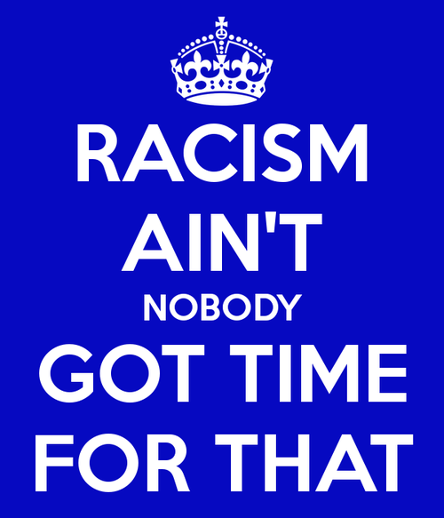

I was recently asked about the “huge increase in racism” in the past few years.  

It’s a topic I’m normally faced with upon returning to North Carolina from abroad. Not sure why. It’s become a leading narrative for many political observers and it seems denotes something very bothersome about what is going on in society. 

I lived in North Carolina for 15 years and I was able to witness some instances of racism, but the kids of my era mostly intermingled and lived on without concerns for this race or that race. We played together, took our first sips of alcohol together, puffed our first cigars together, and listened to the same music. We knew of each other and signed each others’ yearbooks. We cheered for the same football team and dressed up for spirit days.

Once I got into the workforce washing cars and waiting tables, I found it quite enjoyable to share insights with a diverse set of people, no matter their background or race. So it’s quite interesting to be confronted with fears of an ever more racist society.  

Progressives in southern states tend to believe racism only permeates from American conservatives and their ilk, but they’d be surprised to discover there are more outright and dangerous incarnations of racism existent in Europe, South America, and well beyond. North America isn’t special.  

Regardless, I’ve heard many times that we’re living in a [more racist society](http://www.cnn.com/2014/11/26/us/ferguson-racism-or-racial-bias/), and I’ve seen a plethora of stories about how it’s getting worse for race relations, not better.

The proof normally offered is that [some Republican politicians](http://www.salon.com/2014/11/04/it_is_all_still_about_race_obama_hatred_the_south_and_the_truth_about_gop_wins/) have latched on to the hope of President Obama failing. This is viewed less as rational political opposition and more as irrational racist ranting. I find this rather weak. We all know politics is nothing more than a game of football, with two competing sides who despise the other. I don’t think this is increased or decreased by the presence of Obama.  

Let’s not forget Clinton was just as “despised” and was impeached for a few seances with a White House intern. He also [prolonged devastating sanctions on Iraq](https://www.globalpolicy.org/component/content/article/170/41910.html) and [bombed Yugoslavia](http://www.washingtonpost.com/wp-srv/local/natosummit/balkans24.htm), but no one seemed to care about that.

The movement sparked by the killing of Michael Brown, known as “Black Lives Matter,” was about police interaction with minorities, which is truly atrocious, but that’s something promulgated by government and not civil society.  

Drug laws are known to be [racially discriminatory](http://www.theatlantic.com/politics/archive/2014/10/mapping-the-new-jim-crow/381617/), and thankfully people like Sen. Rand Paul and Sen. Cory Booker [are looking to end this and many other laws which target minorities](http://www.politico.com/story/2014/07/cory-booker-rand-paul-team-up-108640.html).  

These kind of laws to me are the most offensive, as it presents a situation where the state, created to protect and uphold rights, is most often trampling them. Look no further than [eugenicist laws](http://www.cnn.com/2012/03/15/health/california-forced-sterilizations/) in places like California and North Carolina, only repealed less than half a generation ago.  

There are legitimate claims about systemic biases against young minority children in [traditional academic settings](http://www.theroot.com/articles/culture/2014/08/_brown_v_board_of_education_anniversary_did_integration_fail_black_children.html), as well as those [aiming to be admitted to upper education](http://www.jbhe.com/features/46_black_student_mismatch.html), but that doesn’t usually become the grand focus of ire for racial justice warriors. And can those be called legitimate intended racism?  

Some have made the argument that a [black-white income gap](http://www.washingtonpost.com/blogs/wonkblog/wp/2013/08/28/these-seven-charts-show-the-black-white-economic-gap-hasnt-budged-in-50-years/) is endemic to racism. Many researchers look at race gaps in employment, housing, and banking, and there does seem to be huge differences [charted on paper](http://www.ncbi.nlm.nih.gov/pmc/articles/PMC2915460/). No doubt.  

But is that how we’re measuring racism today? That some people are worse off than others rather than how they are treated and respected by their societal brethren?

I’m not sure. Of course by that measure, rural people are pretty downtrodden, as well as those [living in red versus blue states](http://www.forbes.com/sites/timworstall/2015/01/04/solved-why-poor-states-are-red-and-rich-states-are-blue/).  

At least for most young people today, we don’t really focus on racial differences in our work and social life. [We shun nationalism](http://thestatelessman.com/2013/01/21/nationalism/), look beyond the prejudices of our forefathers, and use culture as a means of identifying with the people who have similar motivations or passions as ourselves, no matter what they look like.  

Interracial dating is, obviously, normal. [According to the latest figures](http://www.huffingtonpost.com/2012/02/16/interracial-marriage-in-us_n_1281229.html), 1 out of 12 people are in an interracial relationship. [Ten percent](http://www.census.gov/newsroom/releases/archives/2010_census/cb12-68.html) of all opposite-sex marriages are interracial. There are memes all over the Internet about white guys [who date black women](http://madamenoire.com/451724/9-annoying-things-white-men-say-on-dates-with-black-women/), [black men who date white women](http://www.google.com/url?sa=t&rct=j&q=&esrc=s&source=web&cd=9&cad=rja&uact=8&ved=0CFEQFjAI&url=http%3A%2F%2Fgawker.com%2Fthe-reality-of-dating-white-women-when-youre-black-1585401039&ei=dTHmVLuhIce0ggS2wIDgBg&usg=AFQjCNGh-3BxDL5lJpnxbEvnqNhpzqjhVQ&sig2=87oO2-ySi181AGlplMlzrw), [Asians dating whites](http://thoughtcatalog.com/anne-gus/2014/03/asian-women-need-to-stop-dating-white-men/), and every mix of race in-between. Entire [romantic comedies](http://en.wikipedia.org/wiki/List_of_interracial_romance_films) have been filmed using this theme, and it’s not just relegated to modern versions of Othello. It’s embedded in the culture.  

That’s obviously better than when courtship between races was prohibited by state laws, [really only struck down](http://en.wikipedia.org/wiki/Loving_v._Virginia) by _Loving v. Virginia_ in 1967 and a later case in 1970. Oddly enough, Alabama had the laws on the books [until about 15 years ago](http://www.nytimes.com/2000/11/12/weekinreview/november-5-11-marry-at-will.html).   

[Some studies](http://mic.com/articles/72633/okcupid-the-future-of-interracial-dating-except-for-that-part-about-the-racism) claim those seeking love online [tend to favor their own race](http://healthland.time.com/2013/11/04/hope-for-online-dating-study-shows-its-less-segregated/) (expect in the cases of Asian women). [For many](http://mic.com/articles/72633/okcupid-the-future-of-interracial-dating-except-for-that-part-about-the-racism) this is indication about racism and not preference.

Frankly, I don’t know.  

I dated or tried to court women of other races and it didn’t always turn out to be successful. They probably either detested my excessive singing or terrible impressions – but not my skin color (join the club). But that’s how relationships work. Try and fail. Try really hard and maybe succeed. At least in this day and age, love is color blind. And culture blind. In this case, sexual libido wins the day, and it doesn’t discriminate.

There seems to be a lot of uncertainty here because, subjectively, racism just isn’t a part of my life. Racists aren’t a part of my crew. I don’t often meet them, and I certainly don’t respect anyone who hold such views. I respect people based upon their achievements and ideas, and race is a far away construct banged on my head from media.

And that’s obviously where so many guilty white liberals are getting their information about race today. Stories about racist Republican legislators, or voters who want to out the Islamic Obama. Did you care about Ebola infecting your family? [Obviously, you’re a racist](http://dailycaller.com/2014/10/16/msnbc-calls-gop-ebola-criticism-not-even-thinly-veiled-racism-video/). Political correctness defaults for [casting people into the racist camp](http://yesyouareracist.tumblr.com/) despite their intention.  

So, is American society more racist today? Frankly, it depends on how you interpret the world.  

If you believe we are at the pinnacle of human freedom and achievement, and we’re living in a better time with more harmony and less violence, you’re likely to disagree. If you believe American society is on the wrong track and headed towards disaster, certainly if those “other guys” take power, you most likely agree.

Maybe we’re all racists and I’m the biggest one today for bringing this up. Again, I’m not too sure. I like people who enjoy their freedom and wish the same for everyone around them. It may be simple, but it’s just how I interpret the world.
