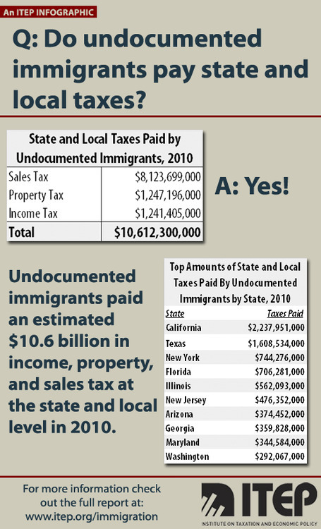

By [Yaël Ossowski](http://watchdog.org/author/yael/ "Posts by Yaël Ossowski")  / [Watchdog.org](http://watchdog.org/200730/immigrants/) / February 19, 2015 

A coalition of 26 states fought and won a battle to freeze President Barack Obama’s deferred action plan to give temporary work visas to illegal immigrants with children born in the United States.

Judge Andrew Hanen’s injunction order, issued Monday, makes certain eligible illegal immigrants won’t get permission from the federal government to seek lawful employment, and will have to continue working without legal papers.

The states who filed the lawsuit claimed such an action would cause “undue burden” to their finances.

“Regardless of the reasons behind the actions or inaction of the executive and legislative branches of the federal government, the result is that many states ultimately bear the brunt of illegal immigration,” wrote Judge Hanen in his [preliminary injunction](http://www.scribd.com/doc/255994877/Memorandum-Opinion-And-Order-Texas-v-United-States) issued Monday.

But if the main reason for opposing legalization of nearly 5 million illegal immigrants comes down to costs, could states actually win out if these immigrants are allowed to pay the same taxes as legal American residents and citizens?

At least one study points to this as a solution.

A [2013 study](http://www.itep.org/pdf/undocumentedtaxes.pdf) conducted by the Institute on Taxation and Economic Policy found that allowing illegal immigrants the legal opportunity to work would actually increase state and local tax revenues by over $2 billion, added to the already $10.6 billion in revenues they contributed in 2010.

For many states facing the danger of tax fatigue, maxed-out budgets and mounting unfunded liabilities caused by rising pension costs, allowing the legalization of certain illegal immigrants could give some much-need help to state finances.

Texas, for example, claimed in the lawsuit against the federal government that Obama’s plan would “impose substantial costs on its budget” by allowing thousands of immigrants the opportunity to apply for driver’s licenses. It claims it would lose “several million dollars” on each license to be processed.

Considering Texas’ 1 million illegal immigrants make up close to [10 percent](http://www.pewresearch.org/fact-tank/2014/11/18/5-facts-about-illegal-immigration-in-the-u-s/) of the state’s labor force, it is more than likely any shortfall would be picked up by additional tax revenue collected by giving these workers legal status.

The study estimates Texas would pick up more than $91 million once illegal immigrant workers are given legal papers.

“We know that undocumented immigrants already pay six or seven percent of their income in state and local taxes, simply because they buy things and they rent or own homes, and sales and property taxes are paid automatically,” said Matthew Gardner, ITEP’s executive director, in a statement [attached to the original report](http://www.itep.org/pdf/undocumentedtaxespr.pdf). “With legalization, both wages and tax compliance will go up, resulting in substantial new revenues for states, especially from the income tax.”

As for the injunction, it seems only the Supreme Court will be able to have the final say on whether Obama’s plan will ever be put into action.

“In reaching this conclusion, Judge Hanen believed that a wholesale, categorical exemption from immigration law is not an exercise of prosecutorial discretion but instead a suspension of the law, which the Supreme Court has made clear is inconsistent with the president’s duty to ‘faithfully execute’ the laws,” said Elizabeth Foley, law professor at Florida International University.

She told Watchdog.org the injunction can now only be reversed by an upper appellate court, either the Fifth District Court, or more likely, the Supreme Court.

“The preliminary injunction essentially is a mechanism to ‘maintain status quo’ until the court can rule on the underlying legal claims being made,” she told Watchdog.org.

The deferred action plan would have continued to beef up security at America’s borders but also allow temporary work authorizations for illegal immigrant families with children who were born in the nation’s borders, [according to U.S. Citizenship and Immigration Services](http://www.uscis.gov/immigrationaction).

This follows a similar executive action issued in 2012, allowing illegal immigrants who were brought to the United States as children and are currently enrolled in school or volunteering in the military to stay in the country and avoid deportation.

Immigrants’ rights group across the country are similarly dismayed by the court order.

“Now millions of people must continue waiting to apply for temporary status to live and work in the U.S. with their families without fear of deportation,” [said Mary Meg McCarthy](http://www.immigrantjustice.org/press_releases/executive-action-preliminary-injunction), executive director of Heartland Alliance’s National Immigrant Justice Center, an immigration law firm. “Families and communities are desperate for relief from the fear of deportation they face every day under our country’s broken immigration system.”

Many leading Republican politicians and anti-immigrant groups, however, celebrated the freeze on allowing immigrants to gain lawful status.

U.S. Sen. Ted Cruz of Texas called the ruling a “[huge victory](https://twitter.com/tedcruz/status/567650275956387840)” and House Speaker John Boehner called on Senate Democrats who disagree with the president to [push for defunding](https://twitter.com/SpeakerBoehner/status/567669506047500289) the Department of Homeland Security, which would carry out the order.  

“Judge Hanen’s ruling preventing the Obama administration from proceeding with a plan to grant amnesty and work authorization to millions of illegal aliens is an important victory for the integrity of U.S. immigration law, American workers and taxpayers, and for our constitutional system of government,” said Dan Stein, president of the Federation for American Immigration Reform, [in a statement](http://www.fairus.org/news/statement-by-fair-on-judge-andrew-hanens-preliminary-injunction-on-obama-amnesty-programs).

“President Obama’s attempt to allow broad classes of illegal aliens the right to live and work legally in the United States, under the guise of discretionary authority, is nothing more than a blatant end-run around the Constitution.”
