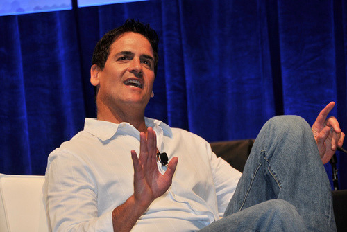

By [Yaël Ossowski](http://watchdog.org/author/yael/ "Posts by Yaël Ossowski")  / [Watchdog.org](http://watchdog.org/201299/mark-cuban/) / February 20, 2015

The idea of the Federal Communications Commission regulating the Internet by way of net neutrality is not only a bad idea in Mark Cuban’s view, but it’s also literally scary.

“Having them overseeing the Internet scares the sh\*t out of me,” said Cuban at the [Code/Media conference](http://recode.net/2015/02/18/billionaire-mark-cuban-says-net-neutrality-will-fuck-everything-up/) hosted in Laguna Niguel, Calif., on Wednesday, one of the largest technology conferences on the west coast.

“Net neutrality is just a demonization of big companies,” [Cuban said](http://recode.net/2015/02/18/billionaire-mark-cuban-says-net-neutrality-will-fuck-everything-up/). “That will f— everything up.”

The serial entrepreneur is best known as one of the first billionaires of the Internet age, [having sold his website](http://www.fastcompany.com/magazine/63/fasttalk.html) Broadcast.com to Yahoo in 1999, right before the dot com crash. He has since become a well-known [investor personality](http://sports.espn.go.com/dallas/columns/story?id=4793301), buying up stock for tech firms and purchasing the Dallas Mavericks NBA team in 2000.

His experience with start-up companies that rely on the Internet is the [main reason](http://www.washingtonpost.com/blogs/the-switch/wp/2014/11/24/why-mark-cuban-opposes-net-neutrality-i-want-there-to-be-fast-lanes/) Cuban says he is opposed to the reclassification of Internet as a public utility under Title II of FCC regulations, which will put certain restrictions on Internet service providers as to how they manage content.

“No one starting a business even considers net neutrality in their business, except for those that are religious about it and ISPs and networks that have to deal with any uncertainty it introduces,” he [said to the Washington Post](http://www.washingtonpost.com/blogs/the-switch/wp/2014/11/24/why-mark-cuban-opposes-net-neutrality-i-want-there-to-be-fast-lanes/) in November.

Cuban gave a similar rant a few months ago invoking the name of famed author Ayn Rand, comparing the present battle with net neutrality to that of excessive regulation on railroads and steel manufactures in her novel Atlas Shrugged, lauded by conservatives, libertarians and government skeptics.

“In my adult life I have never seen a situation that paralleled what I read in Ayn Rands books until now with Net Neutrality,” [tweeted Cuban in November](http://www.cnbc.com/id/102183417#.). “If Ayn Rand were an up and coming author today, she wouldn’t write about steel or railroads, it would be net neutrality.”

He echoes the statements of FCC Commissioner Ajit Pai, who [has seen the plan](http://watchdog.org/198563/fcc-commissioner/) and likened it to nation’s tax agency.

“It gives the FCC the power to micromanage virtually every aspect of how the Internet works,” said Pai [in a statement](https://apps.fcc.gov/edocs_public/attachmatch/DOC-331907A1.pdf) after the plan’s release. “It’s no wonder that net neutrality proponents are already bragging that it will turn the FCC into the ‘Department of the Internet.’”

“For that reason, if you like dealing with the IRS, you are going to love the President’s plan,” said Pai.

The final vote on the new rules proposed by FCC chairman Tom Wheeler are [expected to be passed](http://watchdog.org/198563/fcc-commissioner/) Thursday.
