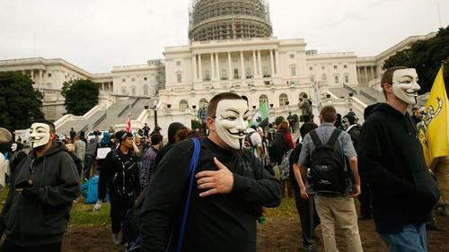

By [Yaël Ossowski](http://watchdog.org/author/yael/ "Posts by Yaël Ossowski")  / [Watchdog.org](http://watchdog.org/201581/fcc/) / February 23, 2015

Whether the public knows it or not, the Internet is set to face its biggest transformation yet when the Federal Communications Commission meets in Washington, D.C. on Thursday.

It’s at this [meeting of the commissioners](http://www.fcc.gov/document/fcc-hold-open-commission-meeting-thursday-february-26-2015), cloaked in bureaucratic mystique, that FCC chairman Tom Wheeler is expected to present the Title II classification of Internet service providers. That means companies offering Internet services would be regarded — and regulated — the same as those offering telephone services.

It will give the FCC an incredible amount of power in crafting rules to guarantee certain “marketplace behavior in a way that protects consumers,” wrote Wheeler in a [Wired article detailing the plan](http://www.wired.com/2015/02/fcc-chairman-wheeler-net-neutrality/) this month.

The plan has been heralded as net neutrality to keep the Internet “[open, fair and free](http://watchdog.org/196422/net-neutrality-cat-memes/)” by proponents, and derided as the first harmful step in regulating the most creative and potent technology of our age by opponents.

Is it a measure of fairness, keeping big Internet companies from dictating what we see online? Is it about keeping the Internet free and open?

At least the public doesn’t seem to think so.

“The public neither understands nor supports the FCC voting on net neutrality rules without greater disclosure of the exact wording and the details of the proposal,” said Peter Hart, founder of Hart Research Associates.

Partnering with the Progressive Policy Institute, a self-titled “New Democratic” think thank, Hart conducted a [detailed survey](http://bit.ly/1CSoz2j) Friday that reveals the extent to which the majority of Americans are opposed to the idea of regulating the Internet.

“Net neutrality is near net zero understanding: just one in four Americans knows what the term refers to, and just one in 10 Americans has positive feelings about it,” said Hart in a [press release](http://www.progressivepolicy.org/press/press-releases/press-release-new-survey-finds-americans-think-fcc-plan-regulate-internet-harmful/) accompanying the results.

According to the survey, 56 percent of Americans say the government shouldn’t take a stronger and more active role in overseeing and regulating the Internet. That’s compounded by the nearly three-fourths of respondents who say they’re not even familiar with the idea of net neutrality.

That’s surely a blow to the active online campaigns highlighting the issue, funded in [large part by the Ford Foundation](http://watchdog.org/187392/ford-foundation/) and many other [progressive organizations](http://watchdog.org/183584/net-neutrality-fcc-fees/) who regularly champion net freedom.

“These findings suggest that the FCC’s bid to impose outdated telephone regulations on the Internet is driven more by professional activists than by the public, which seems instinctively to resist the idea,” said Will Marshall, president of PPI. “That’s why Congress should take a closer look at what the FCC is up to and make sure these issues get a thorough public airing.”

It was conducted Feb. 13-15 by telephone survey with 800 U.S. adults and has a margin of error of 3.46 percent.

This latest poll paints a different picture than a [more cited survey](http://www.udel.edu/cpc/research/fall2014/UD-CPC-NatAgenda2014PR_2014NetNeutrality.pdf) from last November, conducted by the University of Delaware’s Center for Political Communication, often trumpeted by proponents.

It found that 81 percent of Americans oppose “allowing Internet service providers to charge some websites or streaming video services extra for faster speeds,” drawing attention to the uniform answers of both Republicans and Democrats.

It was conducted Oct. 21-26, 2014, from a pool of 900 U.S. residents and has a margin of error of 3.2 percent.

The intended result is obvious from the wording, even as proponents pointed to Republican support of the plan as a “[bipartisan consensus](http://time.com/3578255/conservatives-net-neutrality-poll/).”

As usual, it comes down to semantics and framing. The public is generally against the idea of government regulation of the Internet and similarly against large ISPs charging prices for premium access, a gap of information exploited by both sides in the debate.

Whether the most recent survey reveals a definite public shift against net neutrality and Internet regulation is up for interpretation, but it didn’t stop detractors of the plan from using the results to make their case.

“President Obama’s 332-page plan to regulate the Internet has awakened a sleeping giant,” said FCC commissioner Ajit Pai in reaction to the survey. He’s made his name [likening the plan](http://watchdog.org/198563/fcc-commissioner/) to Obama’s pet project to control Americans’ online behavior.

“Over the last two weeks, it has become clear that the American people want the federal government to keep its hands off of the Internet. Unfortunately, the FCC has steadfastly refused to inform the public because it knows that the more the American people find out about President Obama’s plan, the less they like it,” said Pai [in a statement on the FCC’s website](http://www.fcc.gov/document/pai-americans-oppose-president-obamas-plan-regulate-internet).

Regardless of the debate spearheaded by “professional activists,” Americans will bear the brunt of the decision to come Thursday, when the FCC considers the plan and likely adopts it among partisan lines.
