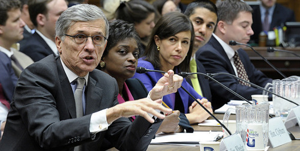
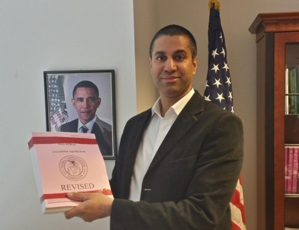

By Yaël Ossowski / [Watchdog.org](http://watchdog.org/202789/internet-regulation/) / February 26, 2015  

Watched by leagues of passionate activists on both sides, the Federal Communications Commission [today passed its first significant Internet regulation](http://www.fcc.gov/article/doc-332260a3) by reclassifying it as a Title II public utility, known as net neutrality.

“The American people reasonably expect and deserve an Internet that is fast, fair and open,” said Wheeler at the [commission hearing](http://www.fcc.gov/article/doc-332260a2). “Today they get what they deserve: strong, enforceable rules that will ensure the Internet remains open, now and in the future.”

The rules agreed upon by three of the five FCC commissioners are intended to curb the influence of larger Internet service providers from implementing higher speed tariffs for certain customers and blocking certain content.

This is marked as the first significant set of rules to be placed on the Internet, which thus far has been able to escape legislation from Congress.

Exactly what it will mean for consumers in the long term is uncertain, however, as the plan has yet to be released to the public.

FCC Commissioner Ajit Pai voted against the plan and has [chided his colleagues](http://watchdog.org/198563/fcc-commissioner/) for not releasing the plan for people to read.

“Here is Pres. Obama’s revised 317-page plan to regulate the Internet. The public still can’t see it. I’m voting no,” [Pai tweeted yesterday](https://twitter.com/AjitPaiFCC/status/570604139266191361).

The FCC has labeled this regulation “strong, sustainable rules to protect the open Internet,” [according to its website](http://www.fcc.gov/document/fcc-adopts-strong-sustainable-rules-protect-open-internet).

“This is a big deal,” said commissioner Jessica Rosenworcel [in her statement](http://www.fcc.gov/article/doc-332260a3). “The result honors the creative, collaborative, and open Internet envisioned by those who were there at the start, including the legendary Sir Tim Berners-Lee, the creator of the World Wide Web—whom we have had the privilege of hearing from today.”
