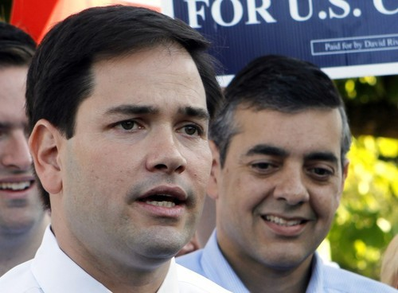

By [Yaël Ossowski](http://watchdog.org/author/yael/ "Posts by Yaël Ossowski")  / February 27, 2015  / [Watchdog.org](http://watchdog.org/202744/immigration/)

In the wake of a [Texas judge’s decision](http://watchdog.org/200730/immigrants/) to halt President Obama’s temporary amnesty for illegal immigrants, derided by most House and Senate Republicans, a quartet of top GOP leaders are bringing fresh perspective to the idea of positive immigration reform within their party and, if their chances bode well, into the next presidency.

The top four names rumored for presidential bids, Sen. Rand Paul of Kentucky, former Florida Gov. Jeb Bush, Sen. Marco Rubio of Florida and Wisconsin Gov. Scott Walker, have so far played to a different tune than their party colleagues when it comes to immigration reform.  

True to form, they’ve followed the Republican line of [securing the borders,](http://watchdog.org/202266/rick-perry-border/) but have been ardent in their embrace of a more long-term, humane approach for dealing with the estimated 11 million illegal immigrants living in the United States.

This will surely cause a rift within the party when the top GOP candidates begin jockeying for the nation’s top job, but it could signify a larger shift in traditional thoughts on immigration based on the current situation.

Facing hostile crowds in New Hampshire [over the weekend](http://www.newser.com/article/2999aa69352f4502bebef02422314cbd/in-new-hampshire-floridas-marco-rubio-challenged-on-immigration-at-during-town-hall.html), Sen. Marco Rubio stuck to his guns when asked about a mass deportation of people who have knowingly broken immigration law.

“You have 12 million human beings in America, most of whom we don’t even know who they are and some of them whom our country’s not going to tolerate rounding up and sending back,” he said to a [crowd in the small rural town](http://www.youtube.com/watch?v=MAQA-wT6nDc) of Hollis [according to AP](http://www.newser.com/article/2999aa69352f4502bebef02422314cbd/in-new-hampshire-floridas-marco-rubio-challenged-on-immigration-at-during-town-hall.html). "That’s not a realistic proposal.”

POLITICO this week [highlighted the support](http://www.politico.com/story/2015/02/scott-walkers-immigration-problem-115303.html) Scott Walker, as Milwaukee County executive, gave to a county-level resolution in 2006 to pass the Secure America and Orderly Immigration Act as his “immigration problem.”

He has since refuted the term “amnesty,” what [many detractors of the bill called it at the time](http://www.politifact.com/wisconsin/statements/2015/feb/04/scott-walker/did-scott-walker-flip-flop-pathway-citizenship/), and emphasized securing the borders. But he categorically rejects the notion of deporting immigrants without legal papers who live in the country.

“But we’ve got to have a healthy balance. We’re a country both of immigrants and of laws,” Walker told ABC News [earlier this month](http://abcnews.go.com/Politics/week-transcript-gov-scott-walker/story?id=28605893&singlePage=true). “We can’t ignore the laws in this country, can’t ignore the people who come in, whether it’s from Mexico or Central America.

Taking a more libertarian position, Sen. Rand Paul first supported a pathway to citizenship while pushing for bipartisan reform in 2013, shocking many in a party so far opposed to talk of legalizing illegal immigrants now in the country.

“If you wish to live and work in America, then we will find a place for you,” he said at the U.S. Hispanic Chamber of Commerce [in March 2013](http://www.cbsnews.com/news/rand-paul-endorses-path-to-citizenship/).

As for Florida Gov. Jeb Bush, he’s written an [entire book](http://www.amazon.com/Immigration-Wars-Forging-American-Solution/dp/1476713464) on the need for taking up immigration reform as a Republican issue and for completely scrapping the current system in favor of a more humane one.

“I support a path to legalization or citizenship so long as the path for people that have been waiting patiently is easier and costs less, the legal entrance to our country, than illegal entrance,” he said on CBS news [while promoting the book](http://www.ontheissues.org/2016_Hopefuls.htm) in 2013.

He’s even created a six[\-part proposal](http://www.ontheissues.org/Immigration_Wars.htm) for immigration reform that could serve as a framework for eventual legislation taken up by the next Congress.

Revising these statements when the nation is in the midst of a larger debate on immigration reveals the issue may not be as partisan and divisive as once imagined.

In fact, it may be the case that the standard Republican position on immigration is due to change in favor of a broader reform, which would avoid deportations and follow the line of what Obama implemented in November.

That all of these top GOP leaders have embraced the need for comprehensive immigration reform doesn’t change, however, the [strict party platform](https://www.gop.com/platform/reforming-government/) on avoiding amnesty at all costs and prioritization of securing the border.

How these top leaders will fare in debates if they decide to pursue the path to the White House is uncertain, but at least a different perspective on immigration reform will be on display.
