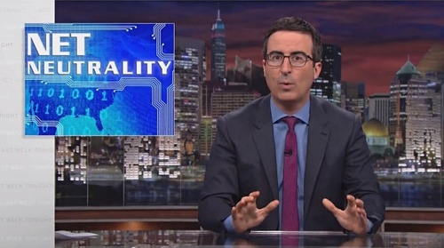

By [Yaël Ossowski](http://watchdog.org/author/yael/ "Posts by Yaël Ossowski")  / March 3, 2015  / [Watchdog.org](http://watchdog.org/203502/net-neutrality/)

After pushing Americans to contact the FCC and lobby to [make the Internet a public utility](http://watchdog.org/202789/internet-regulation/) under Title II, British comedian John Oliver used part of his HBO show Monday to celebrate the regulation and his effort to implement it.

“Yes! Cable and telephone companies will not be allowed to create a two-tired fast lane and slow lane on the Internet,” said Oliver in the opening speech of his program [Last Week Tonight](http://www.youtube.com/watch?v=f72vtTkVS0Y).

Oliver says after the decision “consumers and entrepreneurs are happy,” and went on to criticize Verizon for [releasing a response to the classification in Morse code](http://publicpolicy.verizon.com/blog/entry/fccs-throwback-thursday-move-imposes-1930s-rules-on-the-internet), seemingly poking fun at the use of 1930s regulation on the Internet (Disclaimer: I’m a certified Amateur Radio Operator with a General classification).

“Changing a platform that has been so successful should be done, if at all, only after careful policy analysis, full transparency, and by the legislature, which is constitutionally charged with determining policy,” said Verizon in a [translated version](http://publicpolicy.verizon.com/assets/docs/VZ_NR_--_2-26-15_VZ_Statement_on_Open_Internet_Order_FINAL_1.pdf) of their statement produced in Morse Code. “As a result, it is likely that history will judge today’s actions as misguided.”

Oliver’s simplification of the FCC regulations, still not available to the public, demonstrates he has certainly bought in to the arguments push [many groups funded by the Ford Foundation](http://watchdog.org/187392/ford-foundation/), which sought a greater regulatory control of the Internet by the government.

“Net neutrality is about keeping providers from picking and choosing whose voices get heard,” said Oliver. “Ensuring that the Internet remains a democratic space for all messages.”

Watch the video here:
