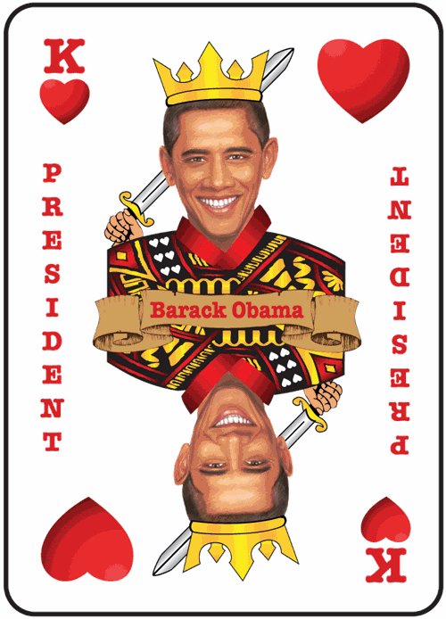

By [Yaël Ossowski](http://watchdog.org/author/yael/ "Posts by Yaël Ossowski")  / March 5, 2015  / [Watchdog.org](http://watchdog.org/203447/house-of-cards-2/)

Taking risks and reaping huge rewards may be a fixture of American politics, but a bill being pushed through committee may completely outlaw the chance for Americans to do the same from their home computer or smartphone on Internet gambling websites.

At least that’s the idea behind [H.R. 707](https://www.congress.gov/bill/114th-congress/house-bill/707), a bill introduced by [anti-gambling champion](http://www.google.ee/url?sa=t&rct=j&q=&esrc=s&source=web&cd=3&cad=rja&uact=8&ved=0CDUQFjAC&url=http%3A%2F%2Fwww.pokerrealmoney.com%2Frawa-back-chaffetz-reintroduces-anti-online-gambling-bill%2F&ei=gEL3VLmONMKuPIjLgJAC&usg=AFQjCNEo9c3zSAAwfmrIjobNmvptsplcvA&bvm=bv.87519884,d.ZWU) U.S. Rep. Jason Chaffetz, sent to the House Judiciary Committee after it was introduced [last month](http://chaffetz.house.gov/press-release/chaffetz-gabbard-work-restore-america%E2%80%99s-wire-act) for a scrupulous examination by lawmakers.

The Restoration of America’s Wire Act, as Chaffetz and his 14 co-sponsors named it, would restore the 1961 prohibition on certain types of gambling establishments and extend that definition to bets made on websites.

Since the Justice Department [issued a ruling in 2011](http://www.justice.gov/olc/opiniondocs/state-lotteries-opinion.pdf) reinterpreting the [Federal Wire Act](http://www.law.cornell.edu/uscode/18/1084.html), the floodgates for online gambling websites within the country’s borders have been held wide open, assuming they weren’t already banned by state law.

The Utah Congressman and GOP rising star is joined by 11 Republicans and three Democrats in sponsoring the bill, including several representatives from southern states.

Chaffetz and main co-sponsor U.S. Rep. Tulsi Gabbard of Hawaii, a Democrat, represent the only two states in the union that completely ban online gambling.

Chaffetz’s claims he’s doing it for the children.

“That is so offensive and wrong,” he [told reporters in D.C. last month](http://watchdog.org/203447/house-of-cards-2/%25E2%2580%259CThat%20is%20so%20offensive%20and%20wrong,%25E2%2580%259D%20he%20said.%20%25E2%2580%259CWhen%20you%25E2%2580%2599re%20a%20seven%20year-old%20kid%20and%20there%20is%20no%20physical%20barrier,%20and%20all%20you%20need%20to%20do%20is%20get%20your%20iPhone,%20that%20becomes%20a%20whole%20new%20world.%25E2%2580%259D). “When you’re a 7-year-old kid and there is no physical barrier, and all you need to do is get your iPhone, that becomes a whole new world.”

“This is the Wild Wild West,” he said. “There are no rules, no prohibitions, no structure, no oversight, nothing.”

In order to achieve this, therefore, congressional Republicans such as Chaffetz push the idea the federal government has a controlling interest in whether Americans should be allowed to places bets and win money online.

The real heart of the issue, therefore, is whether it’s a determination to be made by the federal or state governments.

Should a man playing for money in poker online be prohibited from doing so by the U.S. government or should he have to adhere to state laws that could very well support his hobby?

“The effect of HR 707 would focus almost exclusively on shutting down state-authorized poker, lottery and gaming sites, and banning future sites,” Rich Muny, vice president of the Poker Players Alliance, told Watchdog.org.

“In other words, while they speak to ‘rogue’ offshore sites, HR 707 is all about law-abiding sites licensed and regulated by state gaming authorities,” said Muny.

The PPA was formed in 2006, the same year Congress passed the Unlawful Internet Gambling Enforcement Act, which slowly strangled the then-booming online poker market, in which offshore operators in places like Antigua and the Isle of Man operated international poker games in which Americans participated.

Following passage of UIGEA, market leader Party Poker immediately pulled out of the United States. The Department of Justice shut down the two remaining major sites, PokerStars and Full Tilt Poker, in 2011, resulting in some Americans moving to places like Canada and Costa Rica so they can continue to ply their online poker trade.

Muny said passing RAWA would immediately shut down poker operations in Nevada and completely outlaw gaming and poker websites in New Jersey and Delaware. Six other states that sell lottery tickets online would also be affected.

A hearing on the bill was due to take place Thursday, but has been [rescheduled](http://judiciary.house.gov/index.cfm/hearings?ID=C5FE7783-615A-4FEC-9696-8DFFF876F00E) to a later date.

A coalition of free market think tanks and organizations that include the Competitive Enterprise Institute, Americans For Tax Reform, the American Conservative Union, and Campaign For Liberty [signed a letter stating their opposition](https://cei.org/sites/default/files/Coalition%20Letter%20-%20RAWA%20Opposition%20-%20Nov%2020.pdf) to the bill in November.

“The real intention of this bill is to remove the state’s 10th Amendment authority to regulate online gambling as states see fit within their own borders,” reads the letter. “We hope you will not allow RAWA to become yet another instance where the federal government expands its encroachment into the states’ purview.”

Many critics of the bill point to the overwhelming influence of casino mogul Sheldon Adelson, known for [sinking tens of millions of dollars](http://www.opensecrets.org/527s/527indivsdetail.php?id=U0000000310&cycle=2010) into former House Speaker Newt Gingrich’s 2012 campaign to win the Republican nomination for president.

Poker industry insiders say the bill Adelson supports would ban online gambling, a significant competitor to Adelson’s string of casinos.

“Adelson pledged to ‘spend whatever it takes’ to pass this legislation, and he’s making good on that pledge — at least the spending part,” said Muny. “He and Las Vegas Sands Corp. lobby Congress extensively for this bill.”

Adelson is chairman and CEO of Las Vegas Sands Corp., which has already spent over $1 million to lobby for the bill, [according to the Center for Responsive Politics](http://www.opensecrets.org/lobby/specissue.php?bid=hr4301-113&id=D000020980&year=2014), which tracks political spending.
