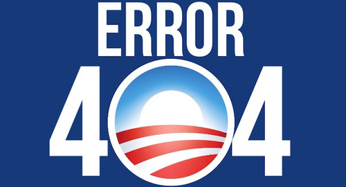

By [Yaël Ossowski](http://watchdog.org/author/yael/ "Posts by Yaël Ossowski")  / March 10, 2015 / [Watchdog.org](http://watchdog.org/204680/hillary-clinton/)

Yet again, Americans can rest reassured their government officials don’t really know how to use email. Or technology for that matter. Save for Hillary Clinton, of course.

This has been made more clear after revelations that former Secretary of State Hillary Clinton [used her private email address,](http://www.nytimes.com/2015/03/08/us/obama-says-he-didnt-know-hillary-clinton-was-using-private-email-address.html) hdr22@clintonemail.com, during her tenure to conduct State Department business, bringing the topic of email and Internet security back into the national limelight.

It’s claimed Clinton [hosted her own email server](http://bigstory.ap.org/article/b78ba433af3a45209668f745158d994c/clinton-ran-homebrew-computer-system-official-emails) at home, a practice [endorsed by privacy enthusiasts](http://arstechnica.com/information-technology/2014/02/how-to-run-your-own-e-mail-server-with-your-own-domain-part-1/) as one of the best ways to avoid the government snooping on your private emails. The irony being, of course, Clinton was one of the country’s most powerful government officials and using this practice.

This set-up allowed Clinton to keep her emails far away from the prying eyes of the [Federal Records Act](https://www.law.cornell.edu/uscode/text/44/chapter-31), which requires government officials to keep digital records of their email correspondence. Her staffers only [recently disclosed her emails](http://www.huffingtonpost.com/2015/03/04/clinton-ran-own-computer-_n_6797824.html) to the State Department for review, according to the Associated Press, and only upon request.

A public probing of Clinton’s email set-up has revealed a staggering ignorance on the part of government officials when it comes to email specifically, and technology more generally.

U.S. Sen. Lindsey Graham, R-South Carolina, declared on national television on Sunday he’s never sent a single email.

“I don’t email,” Graham said on [NBC’s Meet the Press](http://www.nbcnews.com/meet-the-press/lindsey-graham-ive-never-sent-email-n319571). “You can have every email I’ve ever sent. I’ve never sent one. I don’t know what it makes me.”

He’s not alone.

“People have different ways of communicating,” [said U.S. Sen. Benjamin Cardin](http://www.nytimes.com/2015/03/05/us/politics/hillary-clinton-emails-catches-democrats-off-guards.html?hp&action=click&pgtype=Homepage&module=second-column-region&region=top-news&WT.nav=top-news), D-Maryland. “I have a granddaughter who does nothing but text. You’ll never find a letter written with her. So everybody’s different.”

Clinton’s successor, Secretary of State John Kerry, downplayed the issue while at a [public event in Saudi Arabia](http://www.state.gov/secretary/remarks/2015/03/238177.htm).

“I think we have all the (emails) that are state.gov, which are appropriately the ones in the purview of the department,” said Kerry. “But let me check on that when I actually have time to pay attention to such an important issue when I get home.”

A much bigger technological foul on the part of the government is the scandal surrounding the Internal Revenue Service’s [handling of the emails](http://www.nytimes.com/2014/06/17/us/house-panels-looking-into-irss-claims-of-lost-emails.html) of Lois Lerner, the former director of the Exempt Organizations Unit.

Faced by the House Committee on Oversight’s [investigation into its alleged targeting of tax-exempt conservative nonprofit organizations](http://oversight.house.gov/irs/), the IRS claimed to have [lost up to two years](https://www.techdirt.com/articles/20140615/12155027589/irs-claims-two-years-emails-were-destroyed-computer-crash-congressman-asks-nsa-to-supply-missing-email-metadata.shtml)’ worth of Lerner’s emails.

How could this be possible?

Because of a “computer crash,” IRS officials claimed. And any back-ups were [automatically deleted](http://www.washingtonpost.com/blogs/federal-eye/wp/2015/02/27/investigators-probing-for-criminal-activity-with-lois-lerners-missing-emails/), said IRS Commissioner John Koskinen.

This, despite the fact that emails are stored on cloud servers and were explicitly required by law to be recorded and backed up in a secure location.

Months later, it’s [now been revealed](http://www.washingtonpost.com/blogs/federal-eye/wp/2015/02/27/investigators-probing-for-criminal-activity-with-lois-lerners-missing-emails/) those emails are not only recoverable, but an archive of up to 33,000 emails, up to 10 years’ worth, were easily found by a separate department.

Tim Camus, deputy inspector general of the Treasury Department, said finding the emails was done without issue.

“They were right where you would expect them to be,” he told the Oversight Committee on Feb. 27.

Federal officials are now probing for [potential criminal activity](http://www.washingtonpost.com/blogs/federal-eye/wp/2015/02/27/investigators-probing-for-criminal-activity-with-lois-lerners-missing-emails/) related to the covering-up of Lerner’s emails.

And how can anyone forget the infamous “glitch” [embedded on Healthcare.gov](http://www.nytimes.com/2013/10/13/us/politics/from-the-start-signs-of-trouble-at-health-portal.html), which prevented untold thousands of potential users from signing up for the Affordable Care Act in 2013.

The $400 million for the website caused a huge political embarrassment for President Barack Obama.

Other government officials choose not to use email.

“I think email just sucks up time,” former Homeland Security Secretary Janet Napolitano said in [March 2013](http://www.politico.com/story/2013/03/janet-napolitano-email-89317.html). “I stopped using email when I was attorney general of Arizona. I was like, ‘Why am I spending my time scrolling through this?’”

Napolitano [described herself](http://security.blogs.cnn.com/2012/09/28/the-luddite-atop-us-cybersecurity/) as a Luddite, a term used to describe artisans who opposed technological progress in 19th century France.

Keep in mind these are the same public and government officials who are [devising legislation and carrying out policy](http://watchdog.org/77981/cyber-security-swindle-the-next-billion-dollar-boondoggle/) that affect the Internet, email usage and technology for millions of Americans.

It seems the one knowledgeable person who understands how email actually works is Clinton, especially if she thought to host her own mail server.

It takes a high level of technical skill to create — or even delegate — the maintenance of a home server dedicated to email, as revealed in one step-by-step guide [published in Ars Technica](http://arstechnica.com/information-technology/2014/02/how-to-run-your-own-e-mail-server-with-your-own-domain-part-1/).

It can even be complicated for journalists covering the issue.

An article [published Friday by The Blaze](http://www.theblaze.com/stories/2015/03/06/clinton-email-domain-hosted-by-a-company-that-was-hacked-in-2010-and-had-data-redirected-to-ukraine/) claims Clinton’s domain registrar, Network Solutions, was hacked in 2010 and her domain IP address may have been “redirected to a Ukrainian attack server” in the process. A further commentary published on the website makes the assertion the Kremlin [has copies of Clinton’s email](http://www.theblaze.com/contributions/does-the-kremlin-have-hillary-clintons-emails/) as a result of this “hack”.

However, the [MX records reviewed](http://mxtoolbox.com/SuperTool.aspx?action=mx:clintonemail.com&run=toolpage) by Wachdog.org show Clinton’s server was set up on a MXLogic server, [owned by McAfee](http://www.mcafee.com/us/products/saas-email-and-web-protection-suite.aspx), which has never publicly revealed a breach of its systems. McAfee claims to be one of the strongest servers on the market.

And because the domain registrar only pointed to the address of MX records, and did not actually host or house mail servers, the claim of a hack, or potential hack, are overblown. And it surely isn’t a [security nightmare](http://www.bloomberg.com/news/videos/2015-03-05/was-hillary-clinton-s-email-system-a-security-risk-) as some claim.

Rather, it takes some examination of the technology behind email servers to truly understand the issue at heart.
