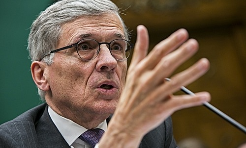

By [Yaël Ossowski](http://watchdog.org/author/yael/ "Posts by Yaël Ossowski")  / March 13, 2015 / [Watchdog.org](http://watchdog.org/205577/net-neutrality-regulations/)  

At long last, the FCC has released its 400-page tome of net neutrality regulations. One sentence alone reveals in a nutshell what’s to come.

It’s to be found in the massive document released by the Federal Communications Commission on Thursday, nearly two weeks after three of the five commissioners adopted the plan.

It reclassifies Internet Service Providers as public utilities under Title II of the Communications Act, originally passed to regulate telephone companies, and forbids them from blocking or diminishing access to content online.

But at least one sentence of the regulation is giving many analysts pause.

“A person engaged in the provision of broadband Internet access service, insofar as such person is so engaged, shall not block lawful content, applications, services, or non- harmful devices, subject to reasonable network management,” reads page seven of the new Internet regulation adopted by the FCC.

Who then, now that these regulations are in effect, will determine which Internet content is lawful and unlawful?

The FCC itself mentions only “unlawful material such as child pornography or copyright-infringing materials,” but leaves the exact interpretation open.

Even the San Francisco-based Electronic Frontier Foundation, which pushed and eventually celebrated the FCC’s intervention in the Internet marketplace, labeled this section of the net neutrality regulation as the “[worrisome bit](https://www.eff.org/deeplinks/2015/02/fccs-latest-net-neutrality-proposal-pros-cons-and-question-marks).”

“Does the FCC intend to suggest that throttling unlawful content is OK? How are ISPs to determine what is and is not lawful without snooping on their users?” asked Corynne McSherry, EFF’s intellectual property director in an article last month.

Indeed, it seems unclear.

Supporters of the principle of net neutrality, that ISPs should not discriminate on the basis of content, also see this as problematic.

“Will we trust telecom to police our data or will it fall into the hands of law enforcement?” asks [a user on IdeaScale](http://openinternet.ideascale.com/a/dtd/Questions-about-the-best-approach-to-lawful-content/17947-6017), a top crowdsourcing website.

If this definition left to the FCC to determine, then torrents, best known for compressing and cutting large files down to tiny packets to easily share across peer-to-peer networks, could effectively be blocked.

Torrents have long proved to be the target for the Motion Picture Association of America, which has pushed ISPs to [crack down on torrents](http://torrentfreak.com/dramatic-bittorrent-site-shutdowns-of-the-decade-091231/) for some time.

It’s entirely possible that a concern for copyrighted material could spurn the FCC to block the unlawful content.

Indeed, the EFF is joined by dozens of top industry leaders now displaying buyers’ remorse when it comes to net neutrality and the extensive rules which come with it.

It’s no secret that several large firms resisted the FCC’s plan to regulate the relationship between Internet consumers and their service providers, but the level of scrutiny now on display has changed the tone of the issue.

Could it be buyer’s remorse?

For many activists, including [those of the Free Press](http://www.freepress.net/blog/2014/03/21/netflix-makes-some-noise-about-net-neutrality), they were brought to action by the alleged that ISPs would “slow down” or even demand higher fees to stream Netflix.

But even Netflix’s own CFO now has doubts.

“Were we pleased it pushed to Title II? Probably not …. . We were hoping there might be a non-regulated solution,” said David Wells, Netflix’s top finance chief, at an [industry conference last week](http://www.siliconbeat.com/2015/03/05/netflixs-net-neutrality-position-questioned/).

Other tech industry leaders are skeptical about what this could mean.

“Fundamentally I believe that access should be open. You should be open and fair in terms of Internet access,” said Nokia CEO Rajeev Suri at the Mobile World Congress [trade show last week](http://www.fiercewireless.com/story/nokia-ceo-argues-against-paid-prioritization-net-neutrality-introduces-prog/2015-03-01). “But there are some services that simply require a different level of connectivity and a different level of service. Driverless cars — you’re not going to do this in a ‘best effort’ network.”

“You just need to be able to differentiate the quality of service for higher paying consumers, otherwise frankly they should feel discriminated (against),” said Suri.

He compared the net neutrality plan to passenger air travel, something average Americans do at least once every few months.

The FCC’s new regulations that ban priority plans for Internet consumers are much akin to the government mandating that each airline passenger not be discriminated against financially based upon their flight route, says Suri. And that would severely impact the service and raise prices significantly.

Doubts about the plan are now bubbling up beyond the tech firms that helped push them, and toward the Internet freedom organizations.

“Title II is for setting up monopolies, not tearing them apart. We need competition, not regulation. We need engineers not lawyers,” [said John Perry Barlow](https://twitter.com/jpbarlow/status/572607628494307328), co-founder of EFF, which radically championed the law as necessary.
