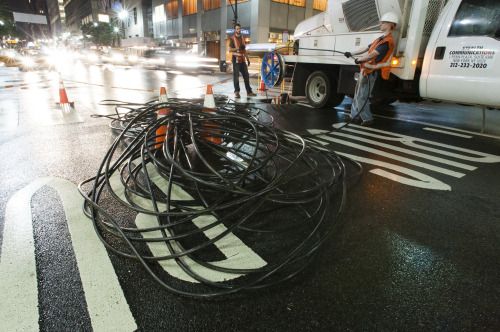

By [Yaël Ossowski](http://watchdog.org/author/yael/ "Posts by Yaël Ossowski") / March 24, 2015 / [Watchdog.org](http://watchdog.org/207664/net-neutrality-regulations-3/)

Much of the debate on the net neutrality regulations — [now a reality](http://watchdog.org/205577/net-neutrality-regulations/) — hinged on the FCC’s role in enforcing the rules. But after all the lobbying, all the pressure, and all the attention, is there a chance for abuse?

For many activists who care about this issue, the final release of the new rules classifying Internet Service Providers as Title II public utilities is [far from the end](https://www.techdirt.com/blog/netneutrality/articles/20150313/08332330310/our-shiny-new-net-neutrality-rules-wont-be-worth-squat-if-fcc-isnt-willing-to-act.shtml) in the battle for net neutrality.

Proponents and detractors alike are still mounting their campaigns.

Last week, Marco Rubio published a [lengthy op-ed](http://www.politico.com/magazine/story/2015/03/government-is-crashing-the-internet-party-116168.html#.VRAvckY7RW3) decrying the efforts of the FCC to regulate key parts of the Internet infrastructure.

“The answer to correcting injustice in an economy is to increase consumer power, not government power,” he wrote in Politico magazine.

For his part, Richard Stallman, founder of the Free Software Foundation and the brain behind the GNU project, an alternative platform which gave rise to Linux, was disappointed at what was presented by the FCC.

“It falls short of true network neutrality in that it fails to tell the ISPs that they can’t examine the data to check for unauthorized copying,” said Stallman during a [conference at MIT](http://www.networkworld.com/article/2900305/opensource-subnet/stallman-joins-the-internet-talks-net-neutrality-patents-and-more.html) over the weekend. “It fails to tell the ISPs that they can’t punish their customers based on what their customers are transmitting.”

Many net neutrality proponents are releasing statements to apply pressure on the Federal Communications Commission, hoping they’ll turn up the heat on ISPs as soon as possible and enforce the prohibitions on throttling and blocking of content [deemed lawful](http://watchdog.org/205577/net-neutrality-regulations/).

One of these groups, Free Press, which was instrumental in pushing net neutrality, along with a host of other organizations [funded by the Ford Foundation](http://watchdog.org/187392/ford-foundation/), immediately called on Congress to get in line and accept the ruling, [accusing many members](http://www.freepress.net/press-release/106857/congress-needs-stick-facts-net-neutrality) of indulging in “conspiracies about the FCC rules.”

Even if groups like Free Press [have chided](http://watchdog.org/207664/net-neutrality-regulations-3/FCC%20chairman%20Tom%20Wheeler,%20a%20former%20cable%20industry%20lobbyist,%20and%20his) and floated similar theories about FCC chairman Tom Wheeler, a former cable industry lobbyist, [due to his connections](http://arstechnica.com/tech-policy/2013/04/new-fcc-chairman-is-former-lobbyist-for-cable-and-wireless-industries/) to Verizon and Time Warner Cable, who actively campaigned against the regulations.

“The restoration of the rule of law is far preferable to the absence of any legal duty to serve without undue discrimination,” said Tim Kerr, Free Press’ senior director of strategy.

But considering pro-net neutrality groups, including the Electronic Frontier Foundation and Free Press, [have blasted](https://www.eff.org/deeplinks/2011/10/publication-fcc-s-net-neutrality-rules-spawns) the FCC for having close ties to the big corporate interests many of them deplore in this battle, such as Verizon and Time Warner Cable, what does that mean for how these rules will be enforced?

“Regulatory capture is always going be a concern in the public policy arena, including at the FCC,” Karr told Watchdog.org.

“Reclassifying broadband access providers as common carriers restores their legal obligation to serve in a just, reasonable and non-discriminatory manner. And it also means that we have restored the people’s due process rights, at the FCC and in the courts.”

Therefore, as long as the rules are in place and issues can be adjudicated, says Karr, all is well.

But if rudimentary Internet issues, which used to take place between private companies, are suddenly thrust into America’s judicial system, in line with the FCC’s regulations regarding network management, it shows a heavier hand for government than first anticipated.

As [CNBC’s Jake Novak observed](http://www.cnbc.com/id/102459456): “Simply put, the net neutrality battle comes down to a question of who do you trust?” Is it private businesses or the government? Which will do a better job in watching over the infrastructure of the Internet?

Depending upon how that question is answered, it’s most likely how people feel about these new regulations.
