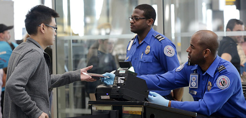

By Yaël Ossowski | [Watchdog.org](http://watchdog.org/208544/tsa/)

The Transportation Security Administration is defending its controversial “behavior detection program” against a torrent of criticism by civil libertarians and a fresh lawsuit by the American Civil Liberties Union.

“The Behavior Detection and Analysis (BDA) program is designed to detect individuals who exhibit anomalous behaviors indicating they fear discovery and may pose a risk to aviation security,” TSA spokesman Ross Feinstein wrote in an email to Watchdog.org. “Officers are trained and audited to ensure referrals for additional screening are based only on observable behaviors and not race or ethnicity.”

That was the TSA’s reaction to the lawsuit filed by the ACLU on [March 19](https://www.aclu.org/national-security/aclu-sues-tsa-records-discredited-behavior-detection-program), excoriating the agency for refusing to release documents on the Screening Passengers by Observation Techniques program, known as behavior detection.

Among other claims made in the lawsuit, the ACLU says the program in place at airports across the country is wasteful and sets up a system of racial profiling.

“What we know about SPOT suggests it wastes taxpayer money, leads to racial profiling and should be scrapped,” said Hugh Handeyside, an ACLU attorney.

“The TSA has insisted on keeping documents about SPOT secret, but the agency can’t hide the fact that there’s no evidence the program works.”

The October 2003 program, according to the Department of Homeland Security, was put in place to “identify persons who pose a risk to aviation security by focusing on behavioral and appearance indicators.”

Rather than solely focus on an individual’s belongings put through airport security, the program observes behavior of passengers while they’re standing in line awaiting screening.

“Behavior detection, which is just one element of the TSA’s efforts to mitigate threats against the traveling public, is vital to TSA’s layered approach to deter, detect and disrupt individuals who pose a threat to aviation,” Feinstein said.

Critics claim only racial minorities and Arab-Americans have been targeted, and demonstrate it is an affront to the civil liberties of every American.

“The discriminatory racial profiling that SPOT has apparently led to only reinforces that the public needs to know more about how this program is used and with what consequences for Americans’ rights,” Handeyside said.

Even government auditors have raised flags on the issue of the program’s effectiveness.

A Congressional Budget Office [report](http://www.gao.gov/assets/310/304510.pdf) from 2010 uncovered the program’s “staffing levels” were the only performance metric to be found. According to the TSA, hiring of more behavior detection experts was the only way to “gauge how fast the program is growing.”

Though the program was set up to deter terrorists, the program has no way to measuring whether it’s even come close to that goal.

Also found in the report is the revelation that most of the techniques employed by TSA agents for behavior detection are the work of Paul Ekman, professor of psychology at the University of California Medical School in San Francisco, one of the world’s foremost experts on facial expressions.

Ekman says it “was not clear” whether this program could even be “used effectively in an airport environment,” a place where individuals are routinely stressed and under pressure.

But despite this criticism, the TSA is relentless in defending the program and claiming it has been effective at deterring terrorists.

“Terrorists have used a variety of items and ways to attempt to inflict harm to aircraft — everything from shoes to liquids — but consistent across all methods of attack is the malicious intent of the actor,” Feinstein told Watchdog.org.

“Looking for suspicious behavior is a common sense approach used by law enforcement and security personnel across the country and the world, that focuses on those behavioral indicators, rather than items, and when used in combination with other security layers helps mitigate a variety of threats.”
