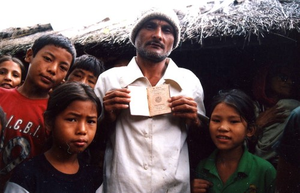

_**Immigration Restrictions Create Distinctions, Not Skin Color**_

[Yaël Ossowski](http://panampost.com/author/yael-ossowski/) | March 26, 2015 | [PanAm Post](http://panampost.com/yael-ossowski/2015/03/26/the-difference-between-expats-and-immigrants-its-passports-not-race/)

Is classifying white westerners as “expats” and others as “immigrants” when they live outside their home countries racist?

That’s the question put forward by Mawuna Remarque Koutonin on the [Guardian website](http://www.theguardian.com/global-development-professionals-network/2015/mar/13/white-people-expats-immigrants-migration) last week: “Why are white people expats when the rest of us are immigrants?”

As both an immigrant and expatriate, the former as a Canadian immigrant in the United States and the latter as a Canadian expat in Austria, there is a stark difference, but it’s not, as he claims, about race.

Koutonin posits that the expat is a label “reserved exclusively for western white people going to work abroad,” and the label of immigrant is “set aside for ‘inferior races'” — even though they both mean a person who “is temporarily or permanently residing in a country other than that of \[his\] upbringing.”

Contrary to his argument, the distinction is more about how government classifies people and less about race.

It’s about passports: citizenship, borders, and travel and work visas. It’s about restrictions put in place by modern governments via contemporary visa regimes. They’re the real culprit.

As I’ve claimed before, in the face of so many mounting government restrictions and obstacles to freedom, [expatriation is often a favorable option](http://panampost.com/yael-ossowski/2014/04/09/when-expatriation-is-the-only-option/). And it’s true that many people can’t do this, nor do they have the flexibility.

I lived in the United States as a Canadian immigrant for over 15 years. My family decided to move down south for economic reasons. It was a permanent move I’m very happy we made.

Until we received our US citizenship, though, we were immigrants. We would have loved to have been expats, but you can’t just live and work on both sides of the border without a lot of paperwork involved. That’s the nature of modern government.

Later in life, I left the United States for Austria, where I currently live as an expat. I travel enough that I’m not a resident here, and I still pay taxes to the US and Canadian governments.

Koutonin claims this is the case because white people, such as Canadians or US Americans, enjoy the “privileges of a racist system,” which divides people based on social class, country of origin, and economic status. But he’s only right on the second point. And it’s the only one that should matter.

Following up with a [post on Silicon Africa](http://www.siliconafrica.com/im-more-white-than-you-live-with-it/), Koutonin articulates that “white is not a skin color nor a race. White is a brand, a social status, an ideology.”

It’s this privilege, Koutonin would argue, that deems my friends from my native Canada or the United States who’ve recently moved to the United Kingdom to be expats, and demotes a highly-qualified Nigerian living and working in the same nation to the status of immigrant.

The reason for the discrepancy, however, is not race, or societal classification, but the pernicious division created by modern visa regimes.

It’s a sad fact that many people in certain nations have a hard time getting the proper permissions to travel and cross borders. They’re often denied visas without reason, and all application fees are non-refundable. These are restrictions created and enforced by governments.

In most cases, countries seek visa agreements with each other in order to bolster travel, trade, and commerce. Some have long-held relationships which tie them together, and they’ve agreed to allow their citizens to travel freely without asking specific permission or filling out reams of paperwork.

This is what makes the Schengen Zone [so attractive](http://panampost.com/yael-ossowski/2013/12/17/free-trade-north-america-turns-21-years-old-free-travel-next/) for those visiting or living in Europe, and [why British passports are so sought after](http://www.telegraph.co.uk/travel/travelnews/10928261/Britain-tops-list-of-worlds-most-powerful-passports.html).

But citizens of many countries simply don’t have this benefit. And it’s based mostly on the diplomatic sphere.

The passports of Finland, Sweden, Germany, the United States, and the United Kingdom are the most powerful in the world, with access to 174 countries visa-free, according to the [Henley & Partners Visa Restrictions Index of 2014](https://www.henleyglobal.com/visa-index-form/?s=1).

Now, is that because of race, or because diplomats, acting on behalf of governments, have made many more visa agreements with other countries in the world?

“Visa requirements are also an expression of the relationships between individual nations, and generally reflect the relations and status of a country within the international community of nations,” says Henley Partners, an [international citizenship-planning firm](https://www.henleyglobal.com/).

It is much easier for someone from the United States to work or retire in Costa Rica than for someone [from Costa Rica](http://costarica.usembassy.gov/consnonimmigrant.html) to do the same in the United States. But that’s because the US government created this obstacle for Ticos by requiring a visa, which Costa Rica doesn’t require of US citizens.

It isn’t an “outdated supremacist ideology” which labels white people living in a foreign country as expats and all others as immigrants; it’s governments. Simple as that.

Therefore, let’s not assign culpability to racism embedded in the western psyche. Rather, it’s the visa and border controls of the modern nation state. They’re intended to restrict movement for as many people as possible, a reality which has only been the case [since World War I](http://panampost.com/yael-ossowski/2013/12/17/free-trade-north-america-turns-21-years-old-free-travel-next/).

These restrictions are what drive thousands of refugees to [stow away on unsafe ships](http://www.unhcr.org/5486e6b56.html) to cross the Mediterranean to Europe, and why nearly [500 people perished in the desert](http://www.wola.org/commentary/the_alarming_rise_of_migrant_deaths_on_us_soil_and_what_to_do_about_it) attempting to reach the United States from Mexico in 2012.

What’s the best way to safeguard against systematic bias against those from certain countries? Open the borders. Relax current visa restrictions for peaceful people who only wish to enjoy the privileges enjoyed by expats everywhere: travel, cultural exchange, and better quality of life.

That’s why increasing numbers of people have signed the [Open Borders Manifesto](http://openborders.info/open-borders-manifesto/). And it’s why [European Students For Liberty](http://esflc.org/) is organizing a conference with the precise theme of [Open Borders](http://panampost.com/yael-ossowski/2015/03/26/the-difference-between-expats-and-immigrants-its-passports-not-race/esflc.org/open-borders). Positive immigration reform is only becoming a [hotter and more pressing political topic](http://watchdog.org/202744/immigration/) in the United States.

Instead of jockeying to find racism in who is an expat and who isn’t, we should allow every individual to live and work where he or she wants.
