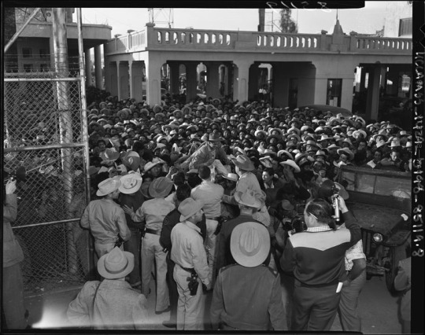
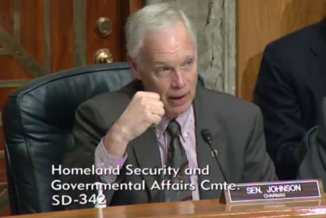

By Yaël Ossowski | [Watchdog.org](http://watchdog.org/209762/guest-worker-program/)

An easy way to fix the convoluted immigration system in the United States entails making it easier for foreigners to be hired, without a lot of red tape in their way.

Even the 8.1 million illegal immigrants now in the workforce.

That, at least, was the consensus of the five witnesses convened to present at the [Senate Committee on Homeland Security and Government Affairs](http://www.hsgac.senate.gov/hearings/securing-the-border-defining-the-current-population-living-in-the-shadows-and-addressing-future-flows) last week.

“I worry about a government that would criminalize the rational activity of someone selling their labor to improve their condition, and another who buys labor in order to make a profit — which is what our current immigration law does,” said Daniel Garza, executive director of the LIBRE Initiative, a free market organization representing Latinos. “I fear a growing government that hinders economic growth, that restricts opportunities.”

He was joined by experts from Pew Research Center, the U.S. Chamber of Commerce, the American Enterprise Institute and the Migration Policy Institute, who were all united behind the idea of expanding the existing guest worker program as a means to trigger economic growth and fix the nation’s immigration problems.

The committee hearing chaired by Sen. Ron Johnson, a Republican from Wisconsin, was called “Securing the Border: Defining the Current Population Living in the Shadows and Addressing Future Flows.“ It focused more on reforming the visa programs than border controls, demonstrating a shift in the conservative examination of immigration.

The meeting was marked by a united front by the conservative-leaning panel of witnesses, coming from industry, academia and activism.

Asked what was needed for Congress to solve the illegal immigration crisis, Randel Johnson, a vice president of the U.S. Chamber of Commerce, pulled no punches. "It’s a combination of an expanded temporary worker programs and a sensible pathway to legalization,” he testified.

He emphasized that it must be easier for companies to hire immigrants to provide for the best educated and skilled employees to compete in the global marketplace.

The U.S. has the largest guest worker program in the world, made up of the H-2A and H-2B visas, which allow employers to temporarily hire foreign workers.

But even with the largest guest worker program in the world, the U.S. also has the distinction of having the largest illegal immigrant population in the world, according to the Migration Policy Institute, which makes for an interesting paradox.

That’s made worse by the fact there has been no significant immigration reform since at least 1996, when stricter policies were enacted and helped bulk up immigration enforcement instead of solving the problem of the growing population of undocumented immigrants.

“Immigration enforcement has cost the U.S. government over $208 billion since 2001,” Marc Rosenblum, deputy director of the Migration Policy Institute, said at the committee hearing. “It spends more on immigration enforcement than any other federal criminal law enforcement activities combined.”

Senator Johnson, the committee chairman, generally agreed with the witnesses, but he remained skeptical about whether accepting larger numbers of immigrants and legalizing those already in the country would hurt the native workforce.

“There is a dispute as to whether undocumented workers have or haven’t depressed wages,” said Johnson, citing a case from a California energy company looking to hire technicians from outside the United States.

His question was immediately addressed and downplayed.

“The bulk of studies unquestionably find that there is almost no effect,” said Madeline Zavodny, economics professor at Agnes Scott College and an adjunct scholar at the conservative American Enterprise Institute. “There is no zero-sum number of jobs. When immigrants come, jobs also get created.”

She was unequivocal in her support for expanding a guest worker program to help not just immigrants but also native workers themselves.

“To protect native workers from unfair competition, we need to allow guest workers to move to employers who want to hire them and want to offer higher wages to have them,” said Madeline Zavodny, economics professor at Agnes Scott College and an adjunct scholar at the conservative American Enterprise Institute.

This positive take on immigration reform is rising not just among conservative economists and activists but [also among the potential top GOP candidates](http://watchdog.org/202744/immigration/) for president, including Sen. Rand Paul of Kentucky, Sen. Marco Rubio of Florida and Gov. Scott Walker of Wisconsin.

“But we’ve got to have a healthy balance. We’re a country both of immigrants and of laws,” Walker told ABC News [in February](http://abcnews.go.com/Politics/week-transcript-gov-scott-walker/story?id=28605893&singlePage=true). “We can’t ignore the laws in this country, can’t ignore the people who come in, whether it’s from Mexico or Central America.

That hasn’t translated over to the majority of Americans, however, as a Gallup poll from as late as January revealed that [60 percent of Americans](http://www.gallup.com/poll/181313/dissatisfied-immigration-levels.aspx) say they are “dissatisfied with the level of immigration into the country today.” That’s a significant drop from the nearly 75 percent who felt the same in 2008, yet it still represents a sense of hostility to immigrants by most Americans.
