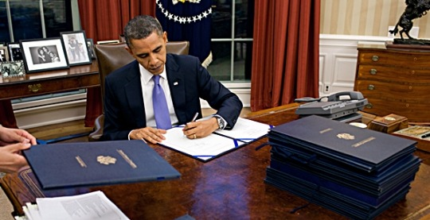

_THE PUNISHER: President Obama signed an executive order declaring hacking a “national emergency” and offers sanctions to seize their property and effects_

By Yaël Ossowski | [Watchdog.org](http://watchdog.org/210300/cyber-hackers/)

If cyber hackers are aiming their malicious code at American companies or government bureaus, they now face the wrath of brutal U.S. sanctions.

That’s the latest law of the land to come from President Barack Obama’s pen — a new [executive order](https://www.whitehouse.gov/the-press-office/2015/04/01/executive-order-blocking-property-certain-persons-engaging-significant-m) signed on Wednesday in which he declared cyber attacks a “national emergency” and orders the punishment and sanction of foreign hackers.

Obama will wield this authority on any individual deemed to be involved in any “cyber-enabled activity” that is likely to result in a “significant threat to national security, foreign policy, or economic health or financial stability of the United States.

This is perhaps the strongest declaration yet against foreign hackers by the federal government, now prepared to use the same sanctions it uses against members of the Iranian and Russian regimes to specifically target those looking to penetrate U.S. infrastructure, whether public or private.

Considering that cybersecurity is at the [forefront of Obama’s agenda](http://watchdog.org/77981/cyber-security-swindle-the-next-billion-dollar-boondoggle/), having been mentioned as a key topic in his 2013 State of the Union address, it’s no surprise he’s pumping up executive action to match his rhetoric.

But that action also leaves plenty of room for interpretation and abuse, especially if harmless online antics are interpreted as major threats to national security.

“Remarkable that denial-of-service attacks are on the list of actions that risk U.S. sanctions,” [tweeted](https://twitter.com/josephmenn/status/583295675204558849) cybersecurity expert and author Joseph Menn. “They are trivial, cheap and ubiquitous.”

Indeed, by extending the state of emergency to any cyber activity that threatens foreign policy or economy of the United States, Obama is casting a wide net never before seen in American law.

A [2013 executive order](https://www.whitehouse.gov/the-press-office/2013/02/12/executive-order-improving-critical-infrastructure-cybersecurity) signed by Obama addressed the dangers posed by foreign intrusion into domestic computer networks, but focused on pressing private companies to share “cybersecurity information” with the government.

That was mostly as a result of the presumed “9/11-Pearl Harbor-sized attacks” [often invoked](http://watchdog.org/77981/cyber-security-swindle-the-next-billion-dollar-boondoggle/) by members of U.S. Senate and U.S. House committees on technology.

This action by Obama points to the [uproar over the hacks](http://www.vanityfair.com/hollywood/2015/02/sony-hacking-seth-rogen-evan-goldberg) that occurred at Sony Pictures, threatening to shut down the screening of the anti-North Korean film “The Interview” and publishing [thousands of emails](http://www.vulture.com/2014/12/everything-sony-leaks-scandal.html) of movie stars and executives online.

The White House initially claimed with certainty it was caused by North Korean hackers, without providing direct evidence, but many [independent security researchers](http://www.usatoday.com/story/news/nation-now/2014/12/18/sony-hack-timeline-interview-north-korea/20601645/) still doubt this claim. But that didn’t stop the president from signing [new sanctions on North Korea](http://www.treasury.gov/resource-center/sanctions/Programs/pages/nkorea.aspx) into law just a few weeks later.

Obama’s latest budget proposal seeks [$14 billion](https://www.google.at/url?sa=t&rct=j&q=&esrc=s&source=web&cd=3&cad=rja&uact=8&ved=0CDAQFjAC&url=https%3A%2F%2Fwww.whitehouse.gov%2Fomb%2Fbudget&ei=qqEdVdXJG4LuavWLgcgM&usg=AFQjCNGoy72c_ocAw9W1aT2VNhtiapl61Q&sig2=JZYuQiYWaA7CZOgiGa2BMw) for federal cybersecurity efforts, mostly centered on the Department of Defense.

_This article also appeared on [Newsmax](https://www.newsmax.com/us/cyberattacks-new-law-obama-hackers/2015/04/03/id/636392/)_
