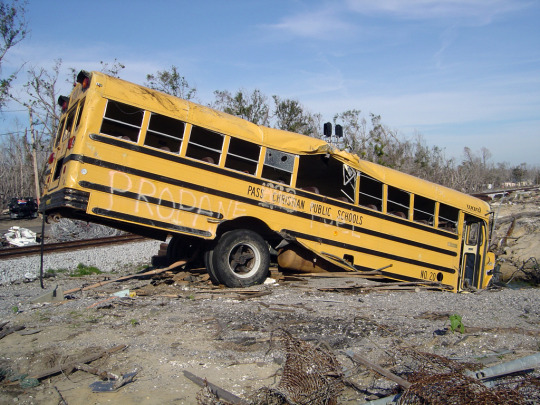

By [Yaël Ossowski](http://watchdog.org/author/yael/ "Posts by Yaël Ossowski") / April 16, 2015 / [Watchdog.org](http://watchdog.org/212359/new-orleans-charter-schools/)

After the devastation of Hurricane Katrina, New Orleans charter schools are giving students more hope for academic success than their peers, the latest studies reveal.

A [study brief released last week](http://www.coweninstitute.com/cowen-institute-releases-brief-on-cmos-in-new-orleans/) by Tulane University’s Cowen Institute details the rise and promise of Charter Management Organizations in reorganizing education in New Orleans’ schools.

These organizations ensure that independent charter schools are no longer centralized as under the old public system, handing responsibility over to charter boards who make decisions about administration, financial concerns and more.

More than 91 percent of students in New Orleans now attend a charter school, the highest rate in the United States.

Now there are more school boards then ever, promising decentralized decision-making that is delivering results.

There are now just 1,056 students per school board, according to the study, a huge decline from the 2004 high of 16,000.

The researchers in this study believe human capital, service sharing, program consistency and more give New Orleans charter schools run by these organizations huge advantages over traditional public school systems.

In the same vein, a study from Stanford [conducted last month](http://urbancharters.stanford.edu/summary.php) found New Orleans charter school students had more academic growth than peers in traditional public schools.

“New Orleans is a fine example of an extended commitment to improving schools,” said Margaret Raymond, director of Stanford University’s Center for Research on Education Outcomes, which conducted the [Urban Charter School Study](http://urbancharters.stanford.edu/summary.php).

Over 53 percent of New Orleans students who graduated last year immediately attended college, [according to the state’s figures](http://www.nola.com/education/index.ssf/2015/04/new_orleans_school_college_rat.html), a huge increase from the 37 percent who enrolled in college right after graduation in 2004.

It’s a breath of fresh air for the Big Easy, which has previously had some of the poorest schools in the country, a fate not held certain after the mighty waters of the 2005 hurricane wiped out entire sections of the iconic city.

In order to rebuild education in a city destroyed by Mother Nature, state and city leaders turned to independently operated public schools, known as charter schools. These schools have flexibility in how they craft their administration, but are still held to the same standard as all schools.

Since 2006, there has been an explosion of the number of charter schools in New Orleans, as local leaders saw huge opportunities to innovate and allow independent authorities, rather than the state alone, to plan and administer schools.
