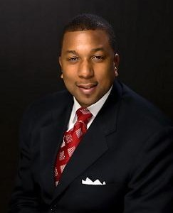

By [Yaël Ossowski](http://watchdog.org/author/yael/ "Posts by Yaël Ossowski")  / April 21, 2015  / [Watchdog.org](http://watchdog.org/213404/charter-school-segregation/)  

The charter school community in North Carolina is [rising up](http://watchdog.org/212874/attack-charter-schools/) against a study put together by Duke University scholars that argues charter school segregation is giving white students an advantage over black students.

“I find the claims that public charter schools perpetuate segregation across our state to be both false and disingenuous,” [Darrell Allison](http://pefnc.org/news/pefnc-president-responds-to-claims-of-charter-schools-and-segregation/), president of Parents for Educational Freedom in North Carolina, told Watchdog.org on Tuesday.

The North Carolina Public Charter Schools Association came out in full force last week against the proposed notion that charter schools were reintroducing “segregation,” a notion picked up by the Washington Post.

Now Allison’s group is weighing in on that newspaper article, which claimed white parents were using charter schools to “secede” from traditional public schools.

“The fact is that public charter schools enroll a greater percentage of black students than traditional schools,” said Allison.

“During the 2013-14 academic year, black students comprised 30 percent of public charter school enrollment and 26 percent of the traditional public school student population,” he said.

He added that the liberalization of rules surrounding charter schools has caused a huge increase in enrollment for children across all race groups, a point overlooked by the study’s authors.

“Since the cap was lifted on public charter schools in our state in 2011, we have seen a 20 percent increase in black students enrolled in public charter schools along with a 21 percent increase in white students enrolled – a mere 1 percent difference,” Allison stated on his organization’s website.

Allison is joined in his criticisms by Eddie Goodall, executive director of the North Carolina Public Charter Schools Association, [who told Watchdog.org](http://watchdog.org/212874/attack-charter-schools/) the study’s main claim is a “thinly veiled and worn theme there that has pretty much been laid to rest by public awareness and sophistication over the post cap years.”

The study was [commissioned](http://www.nber.org/papers/w21078) by the National Bureau of Economic Research by three Duke University professors from the Sanford School of Public Policy, Helen Ladd, Charles Clotfelter and John Holbein.

Thus far there has been no response from the researchers on the negative reactions to the study.
