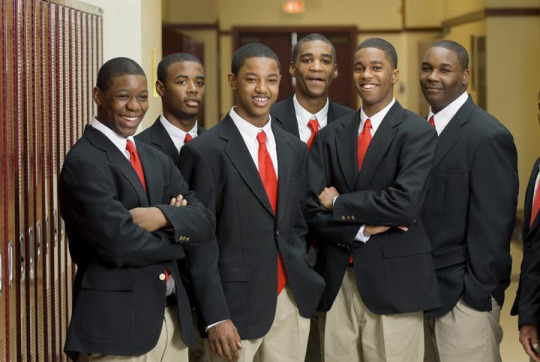

By [Yaël Ossowski](http://watchdog.org/author/yael/ "Posts by Yaël Ossowski") / April 21, 2015  /  [Watchdog.org](http://watchdog.org/212874/attack-charter-schools/) 

There’s a puzzling charge being lobbed at charter schools in North Carolina by academic researchers: they’re reintroducing segregation.

That’s the racially tinged [analysis provided by researchers](http://www.nber.org/papers/w21078) from Duke University, who last week released a study focused on the “growing segmentation” of the charter school sector in the Tar Heel state.

They claim schools in North Carolina are “increasingly serving the interests of relatively able white students in racially imbalanced schools,” all the while making the case that white parents want to avoid schools with large numbers of black students.

That seems to counter the [public and academic consensus](http://www.huffingtonpost.com/2013/06/25/charter-schools-benefit-minorities-poor-families-study_n_3495332.html) that charter schools greatly benefit minorities and poor students, specifically forwarded by a 2013 Stanford University study [analyzing academic performance](http://www.huffingtonpost.com/2013/06/25/charter-schools-benefit-minorities-poor-families-study_n_3495332.html) of particular students.

“The state’s charter schools, which started out disproportionately serving minority students, have been serving an increasingly white student population over time,” say the authors of the Duke study.

The study shows that North Carolina’s charter schools enrollment of white students has risen from 58.6 percent to 62.2 percent over the past 15 years.

But those charters have more than 30 percent enrollment by African-American students while traditional public schools have just 26 percent, [according to the](http://www.ncpublicschools.org/charterschools/) North Carolina Office of Charter Schools.

In that case, it’s puzzling that the researchers would tend to focus on increased white enrollment and claim it’s part of increased segregation. Especially for a state with a population made up of more than 20 percent African-Americans.

The Washington Post’s [piece on the study](http://www.washingtonpost.com/blogs/govbeat/wp/2015/04/15/white-parents-in-north-carolina-are-using-charter-schools-to-secede-from-the-education-system/) summarizes the findings by stating white parents are using charter schools to “segregate” from the regular public school system.

To make such a claim, argues proponents, is preposterous.

“There is are no charter segments based upon race,” said Eddie Goodall, executive director of the North Carolina Public Charter Schools Association. “This is a thinly veiled and worn theme there that has pretty much been laid to rest by public awareness and sophistication over the post cap years.”

He told Watchdog.org the study hits the mark on the importance of adding a “new market element” in public education, a claim that doesn’t attack charter schools.

“Every parent should have access to a high performing district or a high performing charter school, or both,” wrote Goodall in a written response to the Duke researchers. “That’s the target. Allow the market to work.

“Parents have chosen to ‘buy’ North Carolina charter education as evidenced by the 68,000 students in our schools and the 44,000 waiting at the schools’ doorsteps to get in,” said Goodall.

A phone call to the Duke University researchers for comment was not returned.
