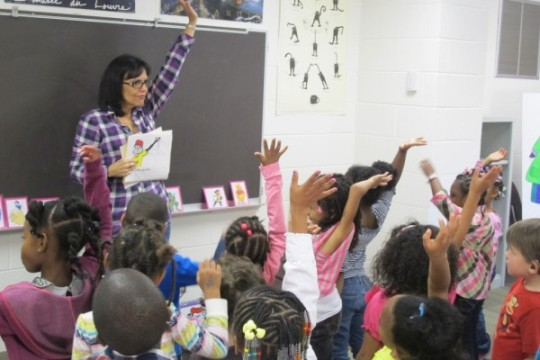

By [Yaël Ossowski](http://watchdog.org/author/yael/ "Posts by Yaël Ossowski")  / April 28, 2015  / [Watchdog.org](http://watchdog.org/214338/minority-students/)  

At the recent Education Writers Association [national seminar](http://www.ewa.org/2015-national-seminar) in Chicago, a small breakout session asked the following question: Is school choice a tool for opportunity and equity, or further segregation?

Following the [latest negative spin](http://www.washingtonpost.com/blogs/govbeat/wp/2015/04/15/white-parents-in-north-carolina-are-using-charter-schools-to-secede-from-the-education-system/) on charter schools around the country, it seems most education journalists decidedly choose the latter.

“If you’re an education writer and aren’t covering segregation in schools, I’d ask you why,” [said Nikole Hannah-Jones](https://twitter.com/molly_hc/status/590315525688922112), winner of the EWA award for best education reporting, in her acceptance speech.

Her comments echo the [controversial study](http://watchdog.org/213404/charter-school-segregation/) released by Duke University researchers in conjunction with the National Bureau of Economic Research earlier this month, which claims charter schools in North Carolina are further segregating public schools and leaving minority students behind.

The Washington Post [says this is proof](http://www.washingtonpost.com/blogs/govbeat/wp/2015/04/15/white-parents-in-north-carolina-are-using-charter-schools-to-secede-from-the-education-system/) white parents are using charter schools to “secede” from the traditional public system. But the figures show otherwise.

According to [Watchdog.org reporter Moriah Costa’s report](http://watchdog.org/187567/d-c-public-school-district-less-diverse-d-c-charters/) on Washington, D.C. schools, charter schools in the nation’s capital have 78 percent black students, a full 10 percent ahead of normal public schools.

And it’s not just in Washington, D.C.

The Center for Education Reform’s 2014 Charter School Survey finds charter schools serve more low-income students, more black and Hispanic students.

“Charter students are somewhat more likely to qualify for Free and Reduced Lunch due to being low-income (63 percent of charter students versus 48 percent of public school students), to being African-American (28 percent of charter students versus 16 percent of public school students) or to being Hispanic (28 percent of charter students versus 23 percent of public school students),” says the study.

Even applied locally, charter schools provide more academic results to a more diverse student body.

A [March 2015 study from the Center for Research on Education Outcomes](http://www.charterschoolcenter.org/sites/default/files/Urban%20Charter%20School%20Study%20Report%20on%2041%20Regions.pdf), an institute hosted at Stanford University, examined 41 different metropolitan school districts and recorded a higher level of academic growth in kids who attend charter schools.

“Our findings show urban charter schools in the aggregate provide significantly higher levels of annual growth in both math and reading compared to their traditional public school peers,” [claims the study](http://www.charterschoolcenter.org/sites/default/files/Urban%20Charter%20School%20Study%20Report%20on%2041%20Regions.pdf).

That includes metros such as Atlanta, Boston, Chicago, Denver, Detroit, Indianapolis, Memphis, Milwaukee, Minneapolis, New Orleans, Phoenix and Washington, D.C.

“Across all urban regions, Black students in poverty receive the equivalent of 59 days of additional learning in math and 44 days of additional learning in reading compared to their peers in traditional public schools,” write the authors.

That’s 48 extra days of math learning and 25 additional days of reading learning for Hispanic students.

In a [provocative 2009 study](http://www.google.at/url?sa=t&rct=j&q=&esrc=s&source=web&cd=1&cad=rja&uact=8&ved=0CCUQFjAA&url=http%3A%2F%2Fwww.vanderbilt.edu%2Fschoolchoice%2Fconference%2Fpapers%2FZimmer_COMPLETE.pdf&ei=gFM-VYT2LoP2ao31geAN&usg=AFQjCNHLO8YQ8jgok3fld1N_qh7HCAQKHQ&sig2=kd9uPdOfWwwEDx-e6TxTOQ), entitled “Do charter schools ‘cream skim’ students and increase racial-ethnic segregation?”, researchers from Mathematica Policy Research at Vanderbilt University couldn’t document any proof of segregation in charter schools.

“We find little evidence that charter schools are systematically creating greater segregation,” said the researchers. In addition, they found that students who transfer to charter schools receive better test scores once they begin in their new schools, not before.

That puts down the claim that charter schools are only recruiting amongst the best students and leaving poor-performing kids behind, a charge often cited by public school activists and [teachers unions](http://www.huffingtonpost.com/2012/09/07/public-charter-school-mov_n_1865151.html).

The most vociferous reactions to the claims of charter school segregation have come from black leaders in the charter school movement.

“Nonsense,” said David Hardy, CEO of Boys Latin of Philadelphia Charter. “Poor public schools do more to increase segregation than any charter,” he told Watchdog.org. Hardy’s school population is made up of approximately 97 percent black students.

Darrell Allison, president of Parents for Educational Freedom, a North Carolina-based charter school organization, blasted the claims as “false and disingenuous.” He [points to figures](http://pefnc.org/news/pefnc-president-responds-to-claims-of-charter-schools-and-segregation/) which show charter schools in the Tar Heel State have a student population with over 30 percent while traditional public schools have only 26 percent.

Considering the facts, the notion that charter schools are further segregating minority students seems to be without support. Whether that will inform the arguments of charter school and school choice opponents is still to be determined.

_Watchdog.org reporters Evan Grossman, Moriah Costa, Mary Tillotson, and Paul Brennan contributed to this report._
