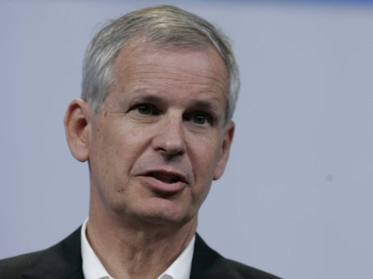
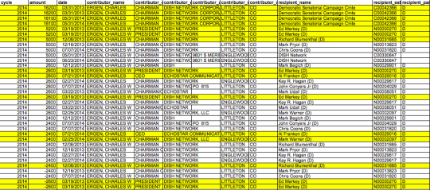

By [Yaël Ossowski](http://watchdog.org/author/yael/ "Posts by Yaël Ossowski")  / May 11, 2015 / [Watchdog.org](http://watchdog.org/217746/ergen/)

Dish Network founder and CEO Charles Ergen’s political giving reveals support for politicians who lobbied the Federal Communications Commission to reserve spectrum space for small companies — spectrum that [Ergen then won in the FCC’s controversial January auction.](http://www.wsj.com/articles/fcc-names-winning-bidders-in-record-wireless-spectrum-auction-1422642337)

In a May 2014 [letter to FCC chairman Tom Wheeler obtained by Watchdog.org](https://watchdog.org/wp-content/blogs.dir/1/files/2015/05/2014-05-14_FCC_Markey_.pdf), six senators, all Democrats, asked the FCC to maintain the agency’s practice of reserving spectrum space for small businesses interested in broadcast.

“We support reserving a portion of available licenses for carriers with limited nationwide low-frequency holdings in order to promote competition, increase auction revenues, and protect against highly concentrated spectrum holding,” wrote Sen. Edward Markey, Sen. Richard Blumenthal, Sen. Al Franken, Sen. Maria Cantwell, Sen. Cary Booker, and Sen. Angus King.

About 10 months later, [Charles Ergen and DISH Network](http://watchdog.org/215589/dish-network-fcc-subsidies/) secured nearly half the spectrum available by claiming an 85 percent stake in two smaller companies, which were given preferential treatment in the reserved space set aside for small businesses.

In the months before and after their letter to the FCC, four of the six signers received campaign contributions totaling $45,000 from Ergen. Ergen has contributed $240,000 to the Democratic Senatorial Campaign Committee since 2008, according to the Federal Elections Commission.

The biggest recipients were Franken and Markey, who lobbied the FCC to reserve spectrum for small businesses. Since 2010, Ergen has given more than $20,000 to Franken’s campaigns and more than $50,000 to Markey’s.

As late as February, after the January auction, Markey praised the FCC’s “promotion of access” in these auctions.

“Following the recent successful completion of the AWS-3 spectrum auction, we are writing to express our support for competition in the wireless marketplace and promotion of access to spectrum by companies of all sizes,” [wrote Markey](http://www.markey.senate.gov/news/press-releases/markey-eshoo-urge-fcc-to-ensure-spectrum-auction-rules-promote-competition-and-access) along with his fellow Communications and Technology Subcommittee members.

FCC filings describe each of the companies — Northstar Wireless and SNR Wireless — not just as a small business, but as a “very small business,” with revenue below $15 million. Dish, with 2013 revenue of about $14 billion, [owned 85 percent of each business.](http://www.wsj.com/articles/kelly-ayotte-and-ajit-pai-ending-welfare-for-telecom-giants-1423095287) Each qualified for federal small-business discounts on the purchase of spectrum rights.

Instead of paying $13 billion for the wireless spectrum, Ergen and his executives paid just $10 billion.

In 2008, Ergen donated more than $30,000 to the National Republican Senatorial Committee and John McCain’s presidential campaign, at the exact moment McCain was involved in a [lobbyist scandal](http://www.nytimes.com/2008/02/21/us/politics/21mccain.html?_r=1&bl&ex=1203656400&en=d0734db651c10475&ei=5087%0A&oref=slogin) in which he was accused of writing letters to the FCC on behalf of a lobbyist with whom he allegedly had a romantic relationship.

_Josh Peterson and Will Swaim contributed to this report._
