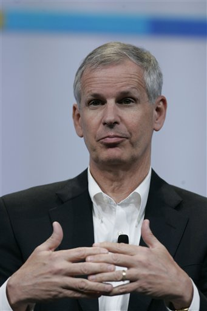

By Yaël Ossowski | [Watchdog.org](http://watchdog.org/218515/dish-ceo-charlie-ergen/)

Anywhere the wind blows in politics, the money is sure to follow.

As for DISH Network CEO Charles Ergen, a top political financier in the U.S. wireless broadcast game and regulation, it hasn’t just been a one-sided venture.

[Reported by Watchdog.org](http://watchdog.org/217746/ergen/) on Monday, Ergen’s hundreds of thousands of dollars of donations to top Democratic leaders, those who lobbied the FCC for rule changes, seem to have eventually benefited DISH Network, which was able to scoop up a considerable amount of wireless spectrum at the latest auction in January at a discount.

Estimates show DISH [saved over $3 billion](http://www.wsj.com/articles/kelly-ayotte-and-ajit-pai-ending-welfare-for-telecom-giants-1423095287) by having large stakes in small businesses which bought the spectrum and transferred it to the company.

But a look at donations to Republicans reveals a very similar scenario when they held ideological control of the FCC just a decade ago.

While Ergen’s personal giving leans heavily Democrat, close to 70 percent, the remaining amount is still significant and not without consideration for the most influential lawmakers on that side of the aisle.

Since 1996, Ergen has given a whopping $436,014 to GOP candidates and campaigns. The biggest single recipient? Sen. John McCain of Arizona.

Beginning with McCain’s run for Senate in 1998 and his later bids for president in 2000 and 2008, Ergen has personally donated over $7,000 to the “Maverick” McCain. At one point, he was also considered one of his [top bundlers](http://freebeacon.com/politics/dish-manipulates-federal-rules-gets-billions-in-discounts-for-wireless-licenses/).

McCain has been pivotal in lobbying the FCC on a number of issues throughout his lengthy senatorial career. In 1998, it was about [reducing the red tape](http://www.rcrwireless.com/19980727/carriers/mccain-lays-foundation-to-revamp-fcc) for wireless companies seeking to expand their networks.

For the year 2013, it was about [uncoupling cable and satellite channel packages](http://variety.com/2013/tv/news/john-mccain-introduces-cable-satellite-legislation-1200478335/), which would have given DISH a huge advantage over its cable competitors who rely much more on these for their bottom line.

In 2006, McCain also urged the FCC to investigate the “[security risk](http://thehill.com/policy/technology/301651-mccain-urges-fcc-to-consider-security-risk-of-sprint-deal)” of allowing SoftBank, a Japanese banking consortium, to buy Sprint. DISH Network was in competition to purchase Sprint at the same time, but lost out.

That’s not even mentioning McCain’s 2008 [influence scandal](http://www.nytimes.com/2008/02/21/us/politics/21mccain.html?_r=1&bl&ex=1203656400&en=d0734db651c10475&ei=5087%0A&oref=slogin) in which he was accused of writing letters to the FCC on behalf of a lobbyist with whom he allegedly had a romantic relationship.

And it extends beyond just McCain’s campaign.

Sen. John Ensign from Nevada, the second largest recipient of Ergen’s political fundraising among Republicans, garnered over $6,000 from the DISH Network CEO between 2004 and 2006.

He has been [instrumental in pushing back](https://www.nab.org/documents/newsroom/pressRelease.asp?id=1592) against the FCC’s regulation on cable and satellite providers.

The influence is not just at the federal level.

In 2010, Ergen gave $5,000, the maximum amount in gubernatorial races, to Bill Haslam, former CEO of Saks Fifth Avenue.

In February, Haslam [sent a letter to the FCC](http://www.google.at/url?sa=t&rct=j&q=&esrc=s&source=web&cd=3&cad=rja&uact=8&ved=0CDIQFjAC&url=http%3A%2F%2Fapps.fcc.gov%2Fecfs%2Fdocument%2Fview%3Fid%3D60001027977&ei=voJTVbDIH4L_UKiegNgJ&usg=AFQjCNGMrXeUea_p1U9ElYDzcXyOD05R4w&sig2=-gGrEfq) declaring his intention to appeal its recent action [allowing cities to expand their municipal broadband services](http://www.tennessean.com/story/news/politics/2015/03/03/tennessee-lawmakers-block-fcc-ruling-broadband/24315417/). Haslam described it as an issue better decided by states.
