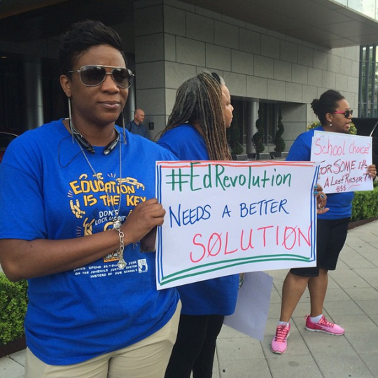

By Yaël Ossowski | [Watchdog.org](http://watchdog.org/220147/charter-schools-in-new-orleans/)

Charter schools in New Orleans have enjoyed growing popular support over the years, but at least one group is hoping to quell the praise for reforms.

The Dignity in Schools Campaign, a nonprofit group against zero-tolerance behavior policies in schools, brought their protest signs to the American Federation for Children Policy Summit held in New Orleans over the weekend to demonstrate their opposition to the charter schools servicing the local community.

“(Dignity in Schools Campaign) members are in #NOLA taking action against American Federation for Children’s National Policy Summit,” reads the caption on a photo [from their Instagram feed](https://instagram.com/dignityinschools/). “Privatizing education is not the answer.”

The main issue at hand is they believe in a fully funded public school system and the weakening of charter schools, which now represent close to 90 percent of New Orleans’ public schools.

“We would prefer that funding would be kept in the public school system,” said organizer Gina Womack to the [Times-Picayune newspaper](http://www.nola.com/education/index.ssf/2015/05/charters_school_choice_debated.html).

Former senator and vice presidential candidate Joe Lieberman made an appearance at the summit, as well as Wisconsin Gov. Scott Walker, a current candidate for the GOP presidential primary.

On hand to speak at the conference were a number of [black educational and school choice groups](http://afcpolicysummit.com/2015-sponsors/) who discussed the positive transformation of New Orleans’ schools, something upheld by the majority of public school parents according to a new poll.

That’s the result of an [extensive survey](http://www.coweninstitute.com/wp-content/uploads/2015/05/cowen.poll_.2015.pdf) released this week by the Cowen Institute for Public Education Initiatives at Tulane University and the New Orleans Advocate.

A full 59 percent of people agree the introduction of charter schools in the New Orleans parish has improved education while 13 percent disagreed.

Over 72 percent support giving parents the opportunity to enroll their child at any school in the city.

Also important to demonstrate in this survey is the impact these schools have had in the wake of the [devastation brought by Hurricane Katrina in 2004](http://watchdog.org/212359/new-orleans-charter-schools/).

“A plurality of respondents believed that schools are better now than before Hurricane Katrina and would recommend New Orleans public schools to a friend or family member,” state the researchers.

The telephone study was conducted with 600 adults between April 7-14 and 60 percent of respondents were African American. It has a margin of error of 4.1 percent.

With the highest proportion of charter schools in the country with 75 of its 82 public schools administered under charters, the case of New Orleans offers an example to other school districts around the country who are ambivalent about accepting new charters.

Just this week, the New Orleans Parish School Board [approved two new charter schools](http://www.nola.com/education/index.ssf/2015/05/new_orleans_charter_schools.html) due to open next year.
