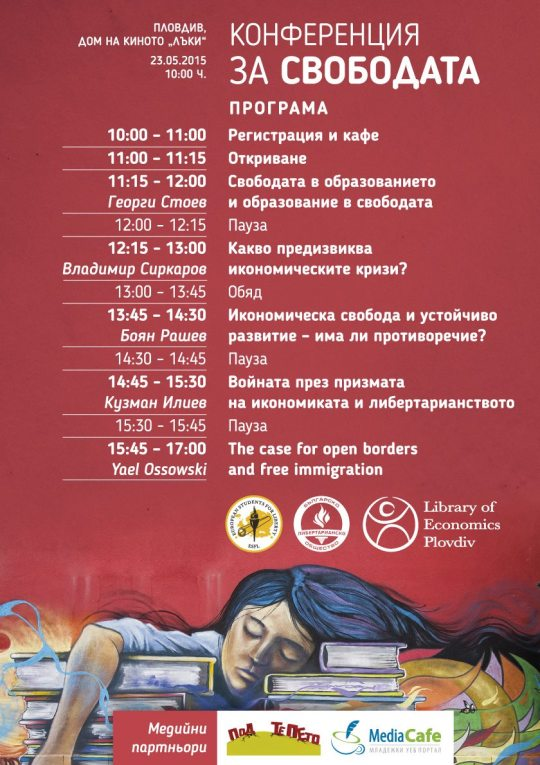

On Saturday, 23. May I gave a speech at an event organized by my friend and **European Students For Liberty** Chairman Stoyan Panchev in Plovdiv, Bulgaria.

It was my speech on **Free Immigration: Defending the Right to Live and Work Anywhere and Everywhere**. Plovdiv was the 5th city and Bulgaria the 4th country I’ve given this speech in.
