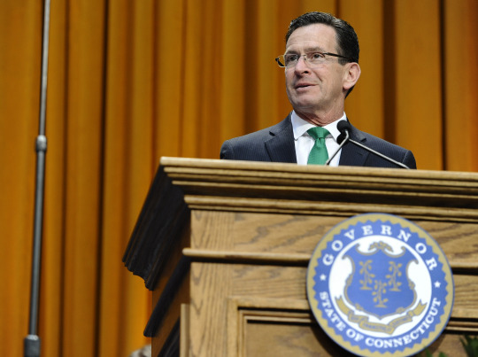

By [Yaël Ossowski](http://watchdog.org/author/yael/ "Posts by Yaël Ossowski")  / June 1, 2015  / [Watchdog.org](http://watchdog.org/222054/sad-day-for-connecticut/)

He once promised to balance Connecticut’s books through spending cuts alone. Now Gov. Dannel Malloy says he’s ready to OK a nearly $2 billion tax increase no later than June 3, when the legislative session ends.

A new budget, passed by the Democratic supermajority on Monday, will raise the state’s top tax bracket to 6.99 percent, from 6.7 percent, impose new taxes on businesses, and kill plans to cut the state’s sales tax.

“A brighter tomorrow will start with this budget today,” said Malloy in a [statement a day before the final vote](http://www.governor.ct.gov/malloy/cwp/view.asp?Q=566452&A=4010). “Most importantly, it helps us build a Connecticut for the long-term, making our state an even greater place to live, work, and raise a family.”

The new budget also kills a plan to reduce the state’s sales tax in October, from 6.35 to 5.85 percent. Along with the new tax hikes, Connecticut residents are expected to fork over $1.8 billion more in taxes in the next year.

Lawmakers hope it will help close what the administration says is a two-year $2.5 billion deficit.

Speaking in committee on Monday morning, state Sen. Scott Frantz said the tax hike represented “another sad day for Connecticut.”

This week’s tax hike was the latest development in Malloy’s ongoing campaign to broaden the state’s tax base, just a few months into his second term as governor.

In February, he struck a nerve among economic-development leaders, saying he’d eliminate several tax credit programs aimed at bringing in entertainment business, [chiefly the sports network](http://www.centralctcommunications.com/bristolpress/news/article_e34dd0c2-bfb3-11e4-bcc8-4fd9c026fe97.html) ESPN. That tax credit is reportedly no longer a part of the state budget.

He’s upset many hospitals and universities by pushing them to pay local property taxes for the first time. That [earned him the ire](http://www.nbcconnecticut.com/news/local/Malloy-Hospitals-at-Odds-Over-Local-Tax-Bill-298803521.html) of both the Connecticut Hospital Association and Quinnipiac University, which have been tax-exempt.

The new budget bill approved by Malloy and pushed by the Democratic supermajority [even taxes digital downloads](http://www.ct.org/tax-on-digital-downloads/) for the first time in state history, a rarity among states. A state lawmaker said the new tax is designed to make brick-and-mortar stores more competitive.

Ranked by per capita income, Connecticut is the richest in the country, each average resident’s salary 137 percent higher than any other American’s, [according to Moody’s](https://www.moodys.com/research/Moodys-assigns-Aa3-to-the-Connecticut-Higher-Education-Supplemental-Loan--PR_326353), a ratings agency.

But it also has the distinction of the third-highest tax burden in the nation, [according to the nonpartisan Tax Foundation](http://taxfoundation.org/state-tax-climate/connecticut), imposing an average 12 percent tax at the state and local level combined.

Despite these high levels of revenue, the state still continues to find itself in budgetary crisis mode, according to its most senior officials.

After analyzing the numbers when Malloy became governor, Ben Barnes, secretary of the governor’s Office of Policy and Management, shocked reporters when he admitted the state was in a “[permanent fiscal crisis](http://www.google.at/url?sa=t&rct=j&q=&esrc=s&source=web&cd=1&cad=rja&uact=8&ved=0CCUQFjAA&url=http%3A%2F%2Fwww.courant.com%2Fopinion%2Fop-ed%2Fhc-op-rennie-malloy-overlooked-fiscal-crisis-1123-20141120-column.html&ei=c7VsVfnzGMmsU9PJgtgI&usg=AFQjCNFeYJx0fPytgGrj1thS-cLTM0PCJw&sig2=iVfM8Xa2OFFK4HLVYg6PBQ).”

With a significant presence in the state, the conglomerate General Electric made a point to comment on the plan to raise taxes on families and individuals.

Fairfield-based GE, one of the five largest companies in the world, warned the tax hike, retroactive to Jan. 1, would make businesses and citizens “seriously consider whether it makes any sense to continue to be located in this state.”

“The Connecticut economy continues to struggle as other states offer more opportunities and a better environment for business growth,” wrote the company in a [general news release](http://www.nasdaq.com/article/ge-issues-statement-on-potential-increase-to-connecticut-taxes-20150601-00848). “It is essential that Governor Malloy and legislative leaders find a more prudent and responsible path forward for Connecticut and its citizens in their current budget negotiations.”

This reliance on tax increases to balance the budget in the Constitution State is a relatively recent development. The state did not impose an income tax until 1991, and was once considered a premier state for investors and entrepreneurs.
