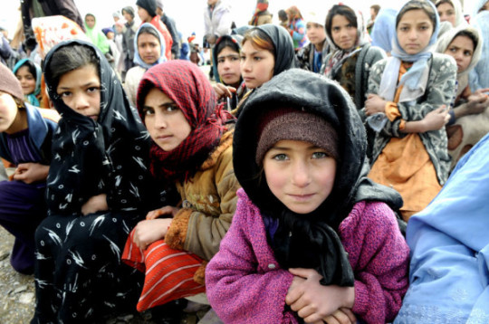

By Yaël Ossowski | [Watchdog.org](http://watchdog.org/227369/girl-power/)

The U.S. government’s ‘girl power’ foreign policy has been signed into law, boosting support for a UN aid project to empower girls in developing countries.

Just last month, President Barack Obama signed the [Girls Count Act](http://www.usaid.gov/results-and-data/budget-spending), promising government resources “to effectively address the needs of birth registries in countries where girls are systematically undercounted.”

In many ways, it is a bipartisan effort. The bill was sponsored by Sen. Jeanne Shaheen, a Democrat from New Hampshire, and Sen. Marco Rubio, a Republican from Florida, and passed overwhelmingly.

It’s the latest push for the Obama administration to get more involved in funding international organizations and their various missions around the world, something on which the federal government spends a good amount of money.

“For too long, the critical issue of making sure children — especially girls — are registered at birth has been overlooked. That ends now,” said Kathy Calvin, president and CEO of the United Nations Foundation.

“For girls worldwide who are not registered, the signing of the Girls Count Act is an opportunity to come out of the shadows and have a brighter future.”

The United States has no shortage of cash dished out to international programs and organizations. In fact, it’s the largest donor to development aid in the world, handing out $35 billion, more than twice the amount of the next country in line, the United Kingdom.

Most of the money is routed through the U.S. Agency for International Development, which administers it according to needs determined by the Department of State.

Though this spending is generally uncontested, there have been efforts to reduce this foreign aid in recent years.

In 2013, Sen. Rand Paul of Kentucky started a campaign to [cut off aid to countries](http://www.politico.com/story/2013/07/egypt-aid-rand-paul-94980.html) hostile to the United States, including Egypt, Pakistan, and even Israel. He even suggested [stopping it across the board](http://www.ibtimes.com/us-foreign-aid-washington-gives-billions-it-money-well-spent-1625994) and even reducing amounts allotted to the United Nations and other international organizations.

Afghanistan, for many years the biggest recipient of U.S. development aid and assistance, [faced its biggest cut in aid last year](https://www.washingtonpost.com/world/national-security/congress-cuts-us-military-and-development-aid-for-afghanistan/2014/01/24/3d4cb818-8531-11e3-bbe5-6a2a3141e3a9_story.html), down to $1 billion from over $2 billion.

“Unfortunately, waste, fraud and abuse has too often been the result when it comes to the billions we’ve spent in Afghanistan,” said Sen. Claire McCaskill, a Democrat from Missouri, at the Homeland Security and Governmental Affairs Committee’s subcommittee on [financial and contracting oversight in 2014](https://www.washingtonpost.com/world/national-security/congress-cuts-us-military-and-development-aid-for-afghanistan/2014/01/24/3d4cb818-8531-11e3-bbe5-6a2a3141e3a9_story.html).

She was joined by many colleagues who seemed wary about increasing foreign aid and assistance without better measures for ensuring honest investment.

Such efforts have yet to pick up steam among other members of Congress, but there has at least been a renewed focus in the course of examining how the government spends citizens’ dollars on programs abroad.

How this will look in the new era of an empowered “girl power” foreign policy by the U.S. government will now be left to the future Congress.
