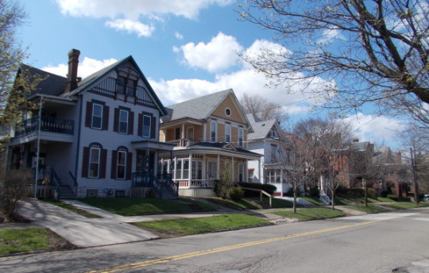

By Yaël Ossowski  | [Watchdog.org](http://watchdog.org/230256/erie-stocks-up-on-prison-gear/)

In 2013, the U.S. Department of Justice awarded Erie, Penn., $600,000 to revitalize its crime-troubled Little Italy neighborhood, and another $300,000 to help combat violence throughout the city.

The money never came.

Last week, following several shootings, the Erie City Council agreed to [spend $25,000](http://www.erie.pa.us/Portals/0/Content/Council/2015/2015-07-15%20minutes.pdf) to boost police equipment in the city’s jails, upgrading the systems that take fingerprints and mugshots of suspects.

The contract was awarded to Dataworks Plus, a Greenville, S.C., technology company that equips police departments.

The motion to accept the funding was quickly rushed through the Erie City Council’s July 15 meeting after hearing comments from local citizens, most of whom urged more community-based measures and less spending on police alone.

The gear will be purchased by the Erie Drug and Vice crime unit, responsible for crimes involving the sale of illegal drugs and related violence.

The Erie Police Department did not return Watchdog.org’s call for a comment on how the equipment will be more useful to thwarting violent crimes in the city.

On July 11, 18-year-old Jacob Pushinsky was shot and killed after refusing to give up his bicycle to 14-year-old suspect Derry Sanders, Jr., according to the police report. His death, one of nearly a dozen in just a few months, has [shocked the community](http://www.thegatewaypundit.com/2015/07/18-yr-old-rotc-member-murdered-by-14-year-old-black-teen-in-erie-pa/).

Some citizens see an issue with the approach the City Council has taken to try to reduce violent crimes in Erie.

“We keep trying the same types of ideas, and the same types of programs and it doesn’t work,” said resident Dan Myzinski [during the meeting’s public comments](https://www.youtube.com/watch?v=GsZzI6NmZu4). “We keep attacking the symptoms, but we’re not looking at the real problem, which is poverty.”

The director of the county department of health, Melissa Lyon, told the Erie Times-News the violence issue should be approached from a public health perspective rather than solely restocking local jails.

“It’s about how people have learned how to live, a culture and behaviors that create and spread the violence,” [said Lyon](http://www.goerie.com/erie-county-explores-public-health-approach-to-curb-violence).

Violence has plagued the city in recent years, making Erie one of the most dangerous cities to live in Pennsylvania.

In the past week alone, there have been 11 reported violent incidents with a firearm, mostly aggravated assault, according to police records.

An Erie citizen has a [1 in 219 chance](http://www.neighborhoodscout.com/pa/erie/crime/) of becoming a victim of a violent crime, while the Pennsylvania state average is 1 in 298.

“Improving historic neighborhoods such as Little Italy benefits Pennsylvania in several ways,” U.S. Sen. Pat Toomey, R-Penn., in 2013, when the city still looked forward to the federal grant money. “Most notably, improvements make our streets safer for families while creating a more favorable environment for economic growth and increased tourism.”

The money was supposed to be shared with the Mercyhurst University Civic Institute, which would have gathered statistics on poverty, crime, and urban blight in Erie, according to the original grant.
