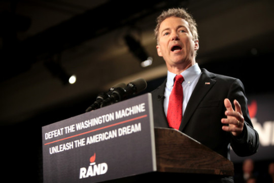

By Yaël Ossowski | [Watchdog.org](http://watchdog.org/230687/rand-paul-economic-freedom-zone/)

Rand Paul wants troubled cities declared “Economic Freedom Zones,” with targeted tax cuts and reduced regulation to promote growth and spur jobs.

So-called Economic Freedom Zones — known as Zones for Employment and Economic Development in their more developed form in places [like Honduras](https://en.wikipedia.org/wiki/Zone_for_Employment_and_Economic_Development_%28Honduras%29) — offer targeted areas the benefits of lower taxes and abstention from certain regulations. The goal is providing a form of government stimulus, different from bailout packages worth billions.

The Kentucky senator has [called for the plan, first unveiled in 2013](https://www.google.at/url?sa=t&rct=j&q=&esrc=s&source=web&cd=1&cad=rja&uact=8&ved=0CCAQFjAAahUKEwiQ1Ky80vHGAhVvWdsKHZLoD5Q&url=http://www.paul.senate.gov/files/documents/EconomicFreedomZones.pdf&ei=bxKxVdDgE--y7QaS0b-gCQ&usg=AFQjCNEWW81qzePypRLgtnXZ2pk-6Qmr5w&bvm=bv.98476267,d.ZGU), in places of high poverty and unemployment — Detroit and certain parts of his native Kentucky, for example. Touted as a quick-fix to areas suffering from economic distress, poor schools and decline, could such a plan effectively work in western Pennsylvania?

James Paul is a policy analyst at the Commonwealth Foundation who examined the plan’s potential.

“I understand the appeal,” he says, “but often these kind of zones or areas bring advantages at the expense of other areas.”

He made the case the offering would more than likely bring in investment from other parts of the state and boost local numbers. But that would effectively take capital from the rest.

“To improve the economic climate in urban areas and cities, you need to look at broad-based tax reduction, reduced taxation on everyone and to expand school choice,” said Paul.

“If these policies are so effective, they should be available to everyone. And most would not take a huge effect until you really implement them at the state level, where most of the policies are actually passed,” he said.

Pennsylvania has a [standard personal income tax rate](http://www.revenue.pa.gov/GeneralTaxInformation/Current%20Tax%20Rates/Pages/default.aspx#.VbEUSLdhpW0) of 3.07 percent, but it imposes the highest corporate tax rate in the country, nearly 10 percent. Under Paul’s plan, this figure would be cut in half, erasing Pennsylvanian’s income tax obligation and giving significant advantage to businesses across the state.

Such a relief could have been a factor in halting General Electric moving its locomotive plant operations from Erie to Fort Worth, Texas, beginning in 2013, cutting 950 local jobs. GE decided to uproot the plant because of Texas’ better tax environment, according to its executives.

“Cost is becoming more and more of a factor,” said Lorenzo Simonelli, head of GE Transportation, [in an interview at the time](http://www.bloomberg.com/news/articles/2013-04-09/ge-plans-to-cut-950-jobs-at-100-year-old-train-plant). “We’ve got to match our competition, and that’s what we’re trying to do.”

Similarly, Erie Insurance Group, the largest single taxpayer in the city of Erie, [filed a motion](http://www.goerie.com/erie-insurance-seeks-big-tax-decrease) last December aiming to reduce its tax burden to stay competitive.

“Another issue is that this is often corporate welfare in disguise,” warns Paul. “There’s an issue of fairness, as certain small businesses would left out in the cold and only those able to gain favor would get an advantage.

“But we consistently support a lower regulatory burden on businesses and lower taxes on everyone. That should be clear.”

Under Sen. Paul’s plan, regulations imposed by the Environmental Protection Agency on Pennsylvania’s coal industry could be temporary lifted. This may save jobs in Fayette and Allegheny counties, which have been threatened [since the EPA began harshly regulating coal plants in 2014](https://stateimpact.npr.org/pennsylvania/2014/07/31/epa-hearings-put-pittsburgh-in-the-crosshairs-of-climate-war/) for their production of carbon dioxide.

Such a move would give a huge advantage to Pennsylvania’s western counties still reliant on the coal industry.

Above all, the biggest issue with the senator’s plan, at least from Paul’s perspective, is feasibility for localities and counties in the state, especially considering the state actually controls most policy put forth in the plan. That’s certainly the case for taxation and most regulations.

The plan’s focus on broadening school choice gets high marks from the Commonwealth Foundation.

“Most school-choice policies, to be effective, must be put in at the state level,” admits Paul.

“But finding a way to make federal funding more portable, creating a scholarship tax credit program and educational savings accounts along with school choice, at the local level, would be most helpful to education,” he told Watchdog.org.
