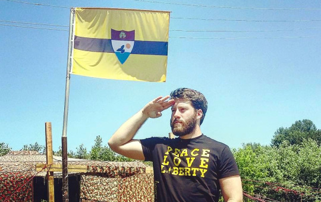
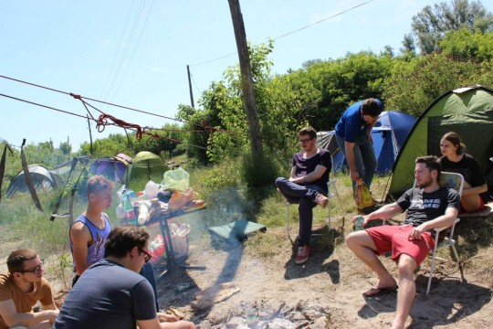
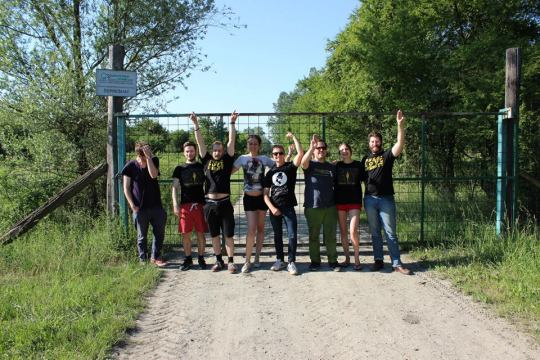

By Yaël Ossowski | [PanAm Post](http://panampost.com/yael-ossowski/2015/08/19/i-tried-to-reach-liberland-and-heres-what-i-learned/)  

Just 20 seconds after crossing the Croatian border, our car was already being tailed by a police sedan.

I gripped the wheel a bit tighter and tried to issue a hand signal to the group behind us. 5-0 on our tail.

He followed our cars for a good 10 minutes until our three-car convoy pulled off into the parking lot of a local cantina, after which he continued straight. Every person opened their car door and burst out laughing.

A personal escort by a Croatian police car was to be expected in our small endeavor. We were attempting to cross into Europe’s newest micro state of Liberland, the disputed piece of territory between Serbia and Croatia on the banks of the Danube River.

The state was [founded and declared](https://liberland.org/en/main/) in April by Vít Jedlička, a Czech libertarian politician and entrepreneur. He said he was frustrated with attempting to implement small government policies in the Czech Republic. Creating a new state was his only solution.

He plans no income tax, no military, an extremely limited constitution and an incredibly lax immigration policy.

At three square miles, it’s larger than Monaco and located just downstream from Vienna and Budapest, though still not claimed by either Serbia or Croatia.

The Croats use it as a bargaining chip in the ongoing territorial negotiations with Serbia – still not completed after the break-up of Yugoslavia – but won’t publicly declare that. That’s how Jedlička could claim Liberland in what he viewed as _terra nullius_, no one’s land.

Liberland has been something of a media sensation across the world. The president has given interviews across the world and embarked on “diplomatic missions” to Croatia, Austria, Norway, Serbia, Poland and more.

In less than a month, his administrative team crowdsourced the constitution and received over 300,000 applications for citizenship – most of them from the Middle East.

**The Truth**

The truth about Liberland, however, is that no one lives there. Croatian border police have made sure of that.

They guard access from land and water and arrest anyone who attempts to cross into the disputed territory, charging them with “illegal border crossing” into Serbia. [Yet, Serbia still says the land doesn’t belong to them](https://www.facebook.com/liberland/photos/a.1795701917322280.1073741828.1635821913310282/1812811648944640/?type=1&permPage=1).

But the most fascinating aspect of Liberland is not the president, the borders or even the proposed structure, but the dedicated band of pioneers looking to settle the land.

They’re the Liberland Settlement Association, a band of shareholders and volunteers who spearhead the activism and infrastructure building behind the dream of the libertarian microstate.

“There are three types of people who come here,” said Kenneth Lillieholm, chief of the makeshift camp located on Serbian territory across from Liberland. “Those who are tourists, those who are here to help build up the LSA, and those who come to get arrested. Which are you?”

It’s the question posed to each new person who finds their way onto the LSA campsite, located in an empty lot adjacent to a small restaurant just outside of Bezdan, Serbia, right on the bank of the Danube. It sits under the bridge that connects cars to Croatia.

On the day our motley crew arrived, comprised of roughly eight student activists, young entrepreneurs and journalists, we were already getting jokes flung in our direction from the local authorities.

“You guys going to Liberland? It’s a new state around here,” said one Serbian border guard jokingly. We took it as the first de-facto recognition. And we did it without diplomatic credentials.

At the base camp of the LSA, Serbian border police park their cruisers and observe the hodgepodge of gathered settlers. They’re considered friendly to those at the camp and curious about the project.

For these rural Serbian officers, the sight of young and middle-aged Danish and Czech libertarians pitching tents, guzzling beers and drawing battle plans on tourist maps make for great fun.

“They most likely haven’t seen foreigners before,” quips my colleague Aleksandar Kokotovic. He’s one of the few Serbs to actually visit the camp and take an interest in Liberland. Naturally, he became an unofficial translator for the weekend.

We learned the local police chief ordered officers to put in shifts at the camp to try to figure out when the next attempted crossing into Liberland would be.

Whether they would relay that information to the Croatian border police wasn’t made clear.

In fact, for any part of the Liberland experiment, Croatia’s opinion on the matter is the biggest mystery.

Serbian officials put out an official communication stating the territory did not belong to them. Croatian border guards arrest anyone caught in Liberland and charge them with illegally exiting the European Union into Serbia.

The problem has always been Croatia. That much is clear.

Until now, there are just two ways people have successfully reached Liberland and evaded arrest.

The first simple option was walking by foot from Croatian territory. This is how Jedlička first reached it, but it’s since been blocked off by Croatian authorities.

Second is by boat from the Danube River, putting over from Serbia.

The issue here is that one must technically exit Serbian waters, enter and Croatian waters and exit again, easily giving Croatian police boats enough justification to ward off any brave sailors. Last time they tried, the settlers had their boat seized by the Croatian police. So this was a no-go for our plan to enter Liberland.

**The attempt**

Huddled over the paper map picked up at the local tourist office, our LSA handlers constructed the plan at base camp.

With a three-car convoy, we were to act as decoys for the main cavalry. The police would follow our vehicles for at least a few miles, and then LSA settlers would cross the border in their designated Land Rover and Mustang (yes, they’re fully equipped) and jet over to the Liberland access point.

At the time, we were the largest convoy to attempt such a crossing, surely enough to confuse and outnumber the Croatian authorities on that side. Unlike previous attempts by the president, there were no boasts on social media to give adequate warning to the border authorities. We were incognito.

At one o’clock in the afternoon, our convoy crossed the border at Batina, Croatia. A police car immediately followed our tail. It was here that we pulled into the cantina after a few miles and watched the police car drive past. Eventually we got back on the road and he followed us again, only peeling off once we took a detour through a small village.

Our convoy made its way to the meeting point and awaited instructions from the seasoned settlers.

Without word for more than five hours at the meeting point, our patience wore thin. It seems the Liberland Settlement Association horribly calculated the times of the operation. Or perhaps members had a tasty lunch. But they never showed up.

Nevertheless, our curiosity could no longer be tamed. We couldn’t suffer the slings and arrows of outrageous fortune camping in Serbia, make an innocent entrance into Croatia and not visit Liberland. This was our mission and we couldn’t let up.

As such, we armed our GPS, packed up our crew of eight and pointed the convoy directly into Liberland territory.

It was an unsanctioned, off-the-books operation. We were ready to put boots on the ground.

Then, less than one mile from Liberland’s prairies, a 10-foot high gate blocked our path. It loomed over and signaled defeat.

The land belongs to a Croatian logging company, and was the only road by which one could reach the land. The shiny new padlock on the gate was the perfect signal that the forces were against us on this one. So it goes.

Alas, we didn’t get to reach Liberland. We met its hopeful first settlers, drank and sang under the moonlight with them and found out it wasn’t so easy to try to set up camp in a microstate.

Not more than five days later, however, two settlers did make it to Liberland, [according to the Liberland Settlement Association](https://medium.com/@LSApress/renewed-aggression-in-croatian-occupied-liberland-84a6c0488558). They recorded video in the swamps and even slept over night. But once they headed back to camp, they were swiftly arrested and thrown in Croatian prison for 24 hours. They say they didn’t have access to a phone or even water. Lawyers weren’t able to call them. They’re both now out of prison and probably don’t plan on going back.

**The Verdict**

Liberland is an idea that lives on, but only on a Serbian campsite or in a Croatian jail cell. That’s just the political reality. It’s an idea better left to the libertarian blogosphere and in the minds of the hundreds of thousands of soon-to-be citizens awaiting their personal utopia.

Perhaps one day it will evolve into a state that can implement all the small-government policies libertarians have advocated since the first government intervention of yesteryear.

But for the moment, it remains a dream.

The aspect libertarians abhor the most, central planning, is what the state lacks the most. No one knows what’s legal and what isn’t legal, and only a handful have ever reached the promise land unperturbed. Every effort has been extirpated.

Had the president declared the new state, pitched his tent on the territory and welcomed settlers without leaving and giving Croatian police the edge, it may have had a chance.

Instead, he banked on the intellectual compromise of diplomats and the guarantee of the freedom of movement between Serbia, Croatia and Liberland. And the full effect of that was shown over this small trip to the disputed separatist country in the middle of Europe.

It’s a dream that will continue, but it’ll need some serious help.

_Source: [PanAm Post](http://panampost.com/yael-ossowski/2015/08/19/i-tried-to-reach-liberland-and-heres-what-i-learned/)_
