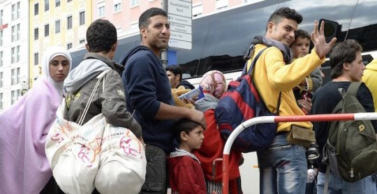

By Yaël Ossowski | [IJ Review](http://journal.ijreview.com/2015/09/247426-helped-cause-refugee-crisis-europe-now-need-help-fix/)Though it’s been knocking on the doors of the European continent for some time, the Syrian refugee crisis is at last making headway in western media around the world.

The image of the body of a three-year-old Syrian boy washed ashore in Bordum, Turkey after an unsuccessful sea voyage to the Greek island of Kos signaled to many people around the world that the status quo in Europe has failed the very people driven to desperation.

And many of those people are fleeing for the hope of not just a better life, but one without ongoing conflict and war.

Since January, 85,150 Syrian nationals have made it into Europe via the Mediterranean, close to 40 percent of the total make-up of refugees who’ve entered this year. They’ve escaped the full-out civil war now over four years old in their home country.

Similarly, over 11 percent of those who’ve made it ashore to Europe are from Afghanistan, says Frontex, the EU’s external border agency. The refrigerated truck full of 71 dead bodies found just an hour from where I live in Vienna was filled with people from Afghanistan.

At the end of 2014, over 60 million people worldwide were displaced because of war, violence and extreme poverty, estimates the United Nations Refugee Agency.

One thing is clear: The levels of human suffering happening on the periphery of Europe, and now in the streets of Budapest and Vienna, are the direct result of disastrous policies of intervention and complete rubblization which have made several Middle Eastern countries just unlivable.

The conflict and devastation ravaging many these countries from which the refugees are fleeing did not occur in a vacuum.

Nations such as the United States, Britain, France, and Canada deliberately bombed portions of Syria and Iraq or provided material support to various factions fighting in the civil war against the Syrian regime or the Islamic State.

Either way, the escalation of the situation made made it impossible for ordinary people to try to sustain life in the places where bombs were exploding and children had no hope for the future. Their only recourse was seek life elsewhere, mostly in Europe.

Since September 2014, the U.S.-led coalition has conducted 6,550 airstrikes on both Iraq and Syria at a cost of $3.7 billion, according to the U.S. Department of Defense.

These bombs have been dropped by planes of the air forces of Australia, Canada, Denmark, France, Jordan, the Netherlands, and the United Kingdom, totaling over 50,000 combat missions with untold numbers of civilian casualties.

With such a devastating amount of firepower aimed down at the very places where many ordinary Syrians and Iraqis lived, is it any mystery that so many want to escape for European shores?

Before politicians in the West begin pointing fingers or shifting the focus from the real issue here, they should understand why so many refugees are landing at the edge of Europe. It’s because of the war, violence and chaos wrought by the coalition.

The European nations of Denmark, France, the Netherlands, and the UK should not only come to terms with their contribution to this crisis, but they should be going out of their way to resettle refugees who nearly escaped their bombs in the last year’s worth of combat missions.

War has a real cost for ordinary people, and it’s just now that we’re seeing the effect of this policy in western countries.

In the United States, the situation for people trying to enter isn’t any better.

In 2013, 444 people attempting to cross the border from Mexico into the United States were found dead by the U.S. Border Patrol. The numbers of those who drowned in the Rio Grande River is unknown but one can only guess.

Despite that, the main native in the American debate on immigration focus on the building of a fence with Mexico, or even my native Canada, to try to keep out as many people as possible.

Attempts by local communities to solve the issues unaddressed or left ambiguous by the federal authorities has people up in arms and committing acts of violence against immigrants from Spanish-speaking countries.

Considering the roots of the United States’ great economic growth, mostly mass immigration from Europe in the 1800s, it’s a wonder that such a pernicious lie is able to exist.

What’s more, the notion of “open borders” which held true in the centuries prior has now been sacrificed out of concern for the welfare state, specifically the benefits offered for native-born American citizens.

What many seem to deny is that there are untold billions in economic growth left untapped by the current regimes of strict border control.

A recent paper by the University of Wisconsin’s John Kennan found that lifting migratory restrictions would more than double the income of newly arrived immigrants and provide a huge boon to domestic economies.

One estimate by the vice president of the Federal Reserve of Dallas found that looser immigration standards would lift worldwide GDP by anywhere from 67 to 147 percent.

It may not be popular in the United States to talk about welcoming more refugees and more immigrants, but it’s as much an economic issue as it is a humanitarian one. Hundreds of thousands of people came to this country to seek opportunity, escape oppression, and to find the American dream.

Why should we deny that to those that need it most?
