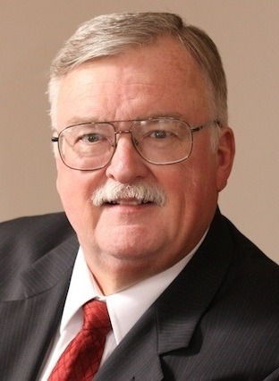

By Yaël Ossowski | September 1, 2015 | [Watchdog.org](http://watchdog.org/236699/ethics-group-broke-state-laws/)

Wherever it campaigns for political ethics reform, the activist group [Represent.us](http://represent.us) seems plagued by legal and ethical challenges of its own.

Earlier this week, Watchdog.org reported that the Represent.us-backed ethics board in Tallahassee, Fla. was slammed – by its own former supporters – [for conflicts of interest](http://watchdog.org/235822/ethics-boards/) in the July hiring of legal counsel.

At almost the [same time](http://www.lansingcitypulse.com/lansing/article-11598-oops.html), a Lansing, Mich., city attorney ruled that a Represent.us-backed ethics group there broke state laws in acquiring signatures for a ballot initiative that would require lobbyists to register with the government and offers public financing of political candidates.

“The Lansing ballot initiative on the ethics board was deemed unconstitutional because it violated numerous provisions of the charter as well as state law,” Lansing City Clerk Chris Swope told Watchdog.org.

The city attorney [determined](http://www.lansingcitypulse.com/lansing/article-11598-oops.html) Represent.us, campaigning to get money out of politics, broke the law when it put money into politics. In hiring a California firm for $25,000 to help acquire signatures in the state, the city attorney charged, the group violated a law that requires that any group that spends more than $500 register with authorities of the state of Michigan as a ballot-question committee.

“These actions, confirmed by you, have indicated to me that the formation of a Ballot Question Committee was necessary and that you have violated Michigan Campaign Finance Law by failing to form a Ballot Question Committee upon spending or receiving more than $500.00,” Ingham County Clerk Barb Byrum wrote in a letter in July to Walter Sorg, head of the [Lansing Citizens for Ethics Reform](http://lansingforethics.org/).

Sorg told Watchdog.org the problem was “a drafting error” by Represent.us.

“The ethics proposal will not appear on the ballot due to claims (by the city) of a drafting error by the attorneys retained by Represent.us,” said Sorg. “That organization decided not to appeal the ruling in court.”

Lansing city attorneys did not respond to a request for comment.

The [Lansing ballot initiative](http://lansingforethics.org/wp-content/uploads/2015/06/Lansing-Anti-Corruption-Ordinance-Full-Text.pdf) written by Sorg with the help of attorneys from Represent.us would have installed an ethics board [much like in Tallahassee](http://watchdog.org/235822/ethics-boards/), but would also have created “limited” public financing for political campaigns.

“The proposal would have strengthened the powers of the existing Board of Ethics, instituted more extensive reporting of finances by public officials, provided for a form of limited public financing of city campaigns, require registration and disclosures by those lobbying the city, and closed the ‘revolving door’ between public service and lobbying,” Sorg told Watchdog.org.

The national campaign by Represent.us to propose changes to campaign and ethics laws in municipalities across the country [next moves on to Seattle in November](http://watchdog.org/235822/ethics-boards/), where a ballot initiative will bring up the question on ethics committees and much more.
