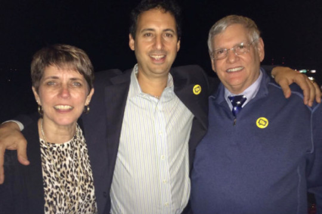

By Yaël Ossowski | September 10th, 2015 | [Watchdog.org](http://watchdog.org/236909/ethics-board/)

The effort to reform politics in the city of Tallahassee in the form of an appointed board was not only undermined by mistakes but also devolved into a disappointment and failure of democracy, say principal supporters of the plan.

“The people of Tallahassee are disgruntled, both left and right,” said Catherine Baer, head of [Citizens for Ethics Reform](http://citizensforethicsreform.org/), the coalition formed to pass the ethics board in the city. She called the board “a lapdog, not a watchdog, which is obviously not what we envisioned.”

“Almost 70 percent of citizens said they wanted an independent ethics committee, and now we’re pretty disenchanted,” Baer told Watchdog.org.

The Tallahassee Ethics Board was started after a November 2014 ballot referendum drafted by [Represent.us](http://represent.us). The Massachusetts-based group hoped the example of Tallahassee would created a grassroots movement to drive money out politics in cities across the nation. The group’s second [effort](http://watchdog.org/236699/ethics-group-broke-state-laws/) to create an ethics board, this time in Lansing, Michigan, failed before it got off the ground, when its central goals were ruled unconstitutional two months ago.

The Tallahassee initiative was hailed by supporters from both the tea party contingent and traditional left-wing groups as the biggest anti-corruption measure in decades, they tell Watchdog.org.

But [cracks emerged almost immediately](http://watchdog.org/235822/ethics-boards/), say two of the board’s key supporters, Baer and Preston Scott.

“The ethics board wandered well off the intent of providing an independent oversight of the city senior staff and commissioners,” Scott told Watchdog.org.

Scott is a local radio show host on 100.7 WFLA who has spent plenty of airtime on the topic of the ethics board and election reforms. He claims mainstream media around Tallahassee have been mostly silent on the controversy.

“I’ve got very little trust in the ethics board and it will likely be facing a lawsuit for actually going against the referendum passed last November,” he said.

“One mistake made was allowing the city of Tallahassee staff and commissioners to appoint a member of the ethics board,” said Scott. “The board is made up of several appointments — one of them belonging to the city. That is an obvious conflict of interest.”

He pointed out that the ethics committee has retained attorney Jerry Currington of the Ausley McMullen law firm as its general counsel. But Currington’s law firm has over $800,000 in litigation contracts with the city, according to [Tallahassee Reports](http://tallahasseereports.com/2015/07/26/city-ethics-board-hires-law-firm-doing-business-with-city-of-tallahassee/) and Baer.

“His law firm has a half-million dollar contract with the city of Tallahassee, which I consider a problem,” Baer told Watchdog.org. “That’s a conflict. He’d have to recuse himself if any city business came up.”

Baer is dismayed at the rate at which the board is ready to pay Currington for his services, on top of his firm’s business with the city government.

“They hired a $267 an hour general counsel,” she said. “Where’s the transparency in this?”

Watchdog.org could not immediately verify Baer’s numbers.

What’s more, Scott says this conflict – hiring as their chief legal advisor the attorney who represents politicians the board is supposed to oversee – negates the very existence of the board.

“In this case, city officials (appointed and elected) placed on the Ethics Board someone who could and would subvert the entire process,” added Scott.

Ironically, [Ausley McMullen also serves as general counsel](http://www.ausley.com/attorney-profile/jerry-curington) to the Tallahassee Democrat newspaper, which has thus far not covered the ethics scandal in its own backyard.

Scott’s concerns [echo previous criticisms](http://watchdog.org/235822/ethics-boards/) from left-leaning groups who sought passage of the Anti-Corruption initiative, including Peter Butzin of Common Cause Florida.

“It was all done behind closed doors,” Butzin told [Tallahassee Reports](http://tallahasseereports.com/2015/07/26/city-ethics-board-hires-law-firm-doing-business-with-city-of-tallahassee/) in July. “We don’t even know who made the decision.”

Baer hails from the local tea party faction and Butzin heads up Common Cause, a well-known left-wing organization. That both sides are disappointed with the ethics board and the passing of the local anti-corruption initiative crafted by Represent.us should give pause to other cities contemplating such as move, says Baer.

“The ethics board, when they were put in place, didn’t know what they were doing, even though we tried to make it as diverse as possible,” Baer told Watchdog.org. “We’re very concerned about this and will continue to be.”

But Represent.us, which wrote the original initiative, continues to defend the ideas behind it.

“The right-left coalition that led the campaign continues to fight to ensure proper implementation of the charter amendment and there’s ongoing work needed to raise the ethical bar and hold city officials accountable,” said Dan Krassner, political director of Represent.us.
