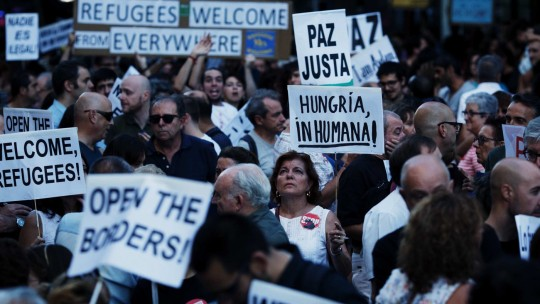

By Yaël Ossowski | September 15, 2015 | [CapX](http://www.capx.co/now-is-the-time-to-uphold-the-schengen-agreement/)

The current refugee crisis represents a moment of great stress for the European project. A plethora of voices are calling for change, but now is not the time to forsake the freedom of movement enshrined in the [Schengen agreement](https://en.wikipedia.org/wiki/Schengen_Agreement).

In the last few months, the surge of refugees, mostly from Syria, Iraq, and Afghanistan, has [strained the resources](http://news.yahoo.com/28-drown-off-greece-hungary-absorbs-record-migrant-144949444.html) of many European countries. This weekend, the panicked German Interior Minister called for the border with Austria [to be reinstated](http://news.yahoo.com/28-drown-off-greece-hungary-absorbs-record-migrant-144949444.html), in order to stop  15,000 people entering Germany in a single day.

At this moment, over 2,100 German border officers are deployed at the border of the small Alpine nation, verifying the documents of those seeking entry. For several hours, the Austrian rail company ÖBB was [forced to halt its service](http://www.thelocal.at/20150913/german-reinstates-border-controls-with-austria) to Munich, leading to a de facto closing of the border between the two German-speaking countries. The Czech Republic has followed suit by stationing guards on its borders with Austria.

The temporary implementation of border controls is allowed by the Schengen agreement. But European nations should avoid the temptation of extreme measures, lest they rupture a finely held ideal that has brought peace, prosperity, and freedom to millions of people.

> But European nations should avoid the temptation of extreme measures, lest they rupture a finely held ideal that has brought peace, prosperity, and freedom to millions of people.

The Schengen area provides the best hope for those who seek to improve their lives. It allows people to vote with their feet: moving to countries where they are safe and best able to live a fulfilling life. As someone who immigrated to Austria, I know first hand the benefits this can provide.

Some have argued that the current crisis is the result of the Schengen policy, but this is misleading. It ignores the causes of the crisis, and the history of immigration in Europe.

The current crisis is the result of a deliberate policy of [western intervention](https://journal.ijreview.com/2015/09/247426-helped-cause-refugee-crisis-europe-now-need-help-fix/) in the Syrian civil war, a policy that has torched an entire region and given rise the brutal force of ISIS.

The result has been a flood of refugees who are fleeing this war and oppression. They are seeking refuge in countries they view as better for their livelihood. And who can blame them? Who can blame any young family currently facing the threat of bombs or persecution in a place like Syria or Iraq?

Yet, despite the media outcry, the current refugee crisis pales in comparison to what Europe has dealt with in the past.

After the Yugoslav wars of the 1990s, over [15.83 percent of the total](http://www.ian.org.rs/publikacije/posleratnezajednice/book/04%20A%20brief%20retrospective%20on%20the%20problem%20of%20refugees%20in%20the%20Yugoslav%20wars%201991-99.pdf) former Yugoslav population [became refugees](http://www.nytimes.com/1992/07/24/world/yugoslav-refugee-crisis-europe-s-worst-since-40-s.html), fleeing to places within their home nations, or to other country in the region. In Bosnia, Croatia, and Kosovo—where the fighting took place—that number jumped to 33.5 percent, over 3 million people.

The great majority of them sought refuge in Austria and Germany. They were well received, integrated quickly, allowed to work, and became a part of the country. A large percentage returned after the fighting died down, but some stayed. As such, there is no reason to think the present Syrian conflict will yield vastly different results.

When one looks at the history of the Second World War and the refugees still spread around the globe, there is no reason to believe that today’s events are extraordinary.

As Global & Mail columnist Doug Saunders recently [reminded readers](http://www.theglobeandmail.com/news/world/three-mistakes-we-keep-repeating-when-it-comes-to-refugees/article26230892/), refugee crises aren’t new, and they aren’t even near the size they used to be. Saunders points to the huge numbers of Hungarians who were seeking refuge abroad due to the crackdown by Moscow-backed socialism. Many of these refugees become responsible citizens of neighboring Austria, numbering over 180,000 at its peak.

That same paper reran an [original editorial](https://i.reddit.com/r/canada/comments/3ju1fr/for_shame_globe_mail_18_december_1956/) last week from its pages in 1956, shaming the government of Canada for failing to accept more Hungarian refugees in a time of huge exodus.  Then, as now, there is a need to allow people to seek refuge and escape the perils of war and oppression.

Some have suggested a new model for coping with the current refugee crisis in Europe. Guy Verhofstadt, the leader of the Group of the Alliance of Liberals and Democrats for Europe in the European Parliament, is even [calling on](https://www.facebook.com/GuyVerhofstadt/videos/10154128953940016/) the EU to fully carry out its integration policy by centralizing asylum and immigration policy.

This may be too drastic a solution for the delicate European project. But it does lead us to consider the problem of expecting select members states to police the external borders for the benefit of all others.

By allowing people their natural freedom to trade and travel in the confines of Europe, Schengen has increased the state of liberty on the continent. The fact that thousands of people fleeing war are temporarily seeking refuge should not be a reason to abandon it, but to strengthen it, and demonstrate its potential for alleviating the pains of war and poverty.
