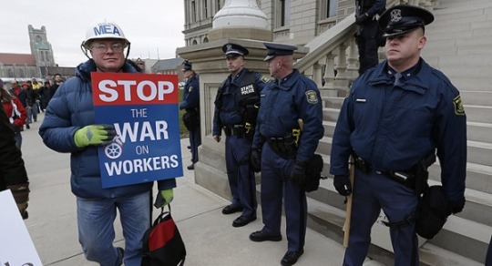

By Yaël Ossowski / September 15, 2015 / [Watchdog.org](http://watchdog.org/238132/vicious-political-campaigning/)  

They say it takes extraordinary circumstances to get ordinary people into politics. For Mary Hill, a registered nurse, that extraordinary moment came when union activists began pressuring workers at her hospital to unionize.

She was ready to join the union, she tells Watchdog.org, but began to question the union’s motives when  leaders began injecting politics into the workplace — politics unlike her own.

“I was frustrated with them forcibly unionizing workers and the hospital,  even targeting them. “They’d go around doing vicious political campaigning about Obamacare — and that was in a hospital,” she told Watchdog.org.

“I’m not against unions at all, but national unions don’t have the individuals’ interest in mind. They’re only there to gain political support,” said Hill. “Nurses are too busy with patients to need to have to worry about what unionization will mean for them.”

Hill is among several former union members hoping to persuade Missouri lawmakers to [override a veto](https://governor.mo.gov/sites/default/files/HB%20116%20and%20569%20veto%20letter%20-%20June%204,%202015.pdf) by Gov. Jay Nixon on a right-to-work bill. A vote on the bill, which would end compulsory union membership in the state, could take place within days.

Phill Todd, a Missouri resident and BAC union member, recalls an encounter with his leadership in 2004, when his union actively endorsed Democratic presidential candidate Rep. Richard Gephardt.

“I went into the union hall and they had the signs up there for Gephardt for president and McCaskill and all that kind of stuff…. I was a little bit alarmed about that because there was no way that I was going to support Gephardt,” Todd told Watchdog.org. “Nobody had ever asked us who we would prefer.”

He said union leaders were handing out shirts that read “Gephardt for President. BAC supports Gephardt. He’s ours,” which Todd didn’t want to wear.

Other union members also say their leadership actively spends a good portion of union dues on political campaigning, almost always for Democrats.

“Their money goes to Democrat candidates and Democrat issues,” said Ron Staggs, also resident of Missouri, and a former member of Communications Workers of America. “You have no say on anything on how the money’s spent. It’s sent to the national level and it’s spent at the national level,” he told Watchdog.org. “And it rolls back down from the national levels to political campaigns.”

Their concerns were exactly what drew Mary Hill to start rallies promoting right-to-work in her state.

The first rally in 2013 gathered just over 100 people, says Hill, bringing together stakeholders publicly for the first time in Missouri. The next one, just a few months later, brought in over 200, including many important members of the Missouri Legislature.

“Now we’ve got the support of the lieutenant governor and former governor,” she said.

_Nicholas C. Fondacaro contributed to this report_
