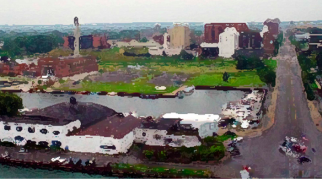

By Yaël Ossowski | September 18, 2015 | [Watchdog.org](http://watchdog.org/238762/comprehensive-plan/)

Hoping to leap into the future, Erie will spend [over $100,000](https://www.planning.org/news/daily/story/?story_id=id:mx8vErq1Jw__vKG29ADPyGPS8XkxpEUlIzERs8o4tXoYWzNqBnhWpwQX5SzML2bU&source_type=O) to pay consultants to draw up a 10-year comprehensive plan to revitalize the city and “bring it into the future.”

The total amount of $137,880, approved preliminarily by the [city council in February](http://www.erie.pa.us/Portals/0/Content/Council/2015/2015-02-04%20agenda.pdf), will be paid to consulting firm CZB, an Alexandria, Virginia-based urban planning firm.

As revealed [in a 2005 presentation](http://planningpa.org/presentations/05/pbb_part1.pdf) by Pennsylvania Governor’s Center for Local Government Services, the main purpose of these plans is to give a city “priority consideration in state funding,” meaning it can get better access to the state’s coffers to fund its projects.

The [background analysis](http://www.erie.pa.us/Portals/0/Content/Departments/ECD/Plans%20and%20Documents/Background%20Analysis%20City%20of%20Erie%20Comprehensive%20Plan.pdf) for the comprehensive plan conducted last March by Peter J. Smith & Company, another urban planning firm, reveals the top project areas to be tackled in the city-level plan. That includes marketing the city “as a destination and community of choice for residents, businesses and investors and visitors,” states the report.

Chief among them is the recurring problem of housing and urban development, but also the decreasing population and effect of climate change. The analysis says the city should be prepared to promote more public transportation and invest in alternative energy resources.

It makes no mention of addressing tax reform or lowering taxes.

CZB Founder Charles Buki was [present in Erie last week](http://www.erie-comprehensive-plan.org/process/) at public hearings to present his outline of the 10-year comprehensive plan to the public and hear feedback from residents. It’s due for completion early next year.

“Based on everything we’ve seen in Erie, dealing with pervasive blight in a strategic manner is one of the city’s four top priorities,” Buki said in an interview with the [Erie Times News](http://www.goerie.com/our-view-see-what-eries-comprehensive-plan-means). “The others being the continued revitalization of downtown, fully leveraging the potential of the bay front and rebuilding your middle class.”

Buki’s office did not respond to Watchdog.org’s questions on how much the total plan would cost Erie taxpayers.

A similar comprehensive plan already exists at the the [county level](http://emerge2040.org/wp-content/uploads/2015/03/DE-Final-3-25-15.pdf), released in March, and triggers planning until the year 2040. It’s estimated to cost over $3 million to implement over the next few years.

While the county-level plan is subsidized by grants from the federal Department of Housing and Urban Development, to the tune of $1.8 million, it’s not clear if it will trickle down to cities.

The municipal-level comprehensive plan is required by the Pennsylvania Municipalities Planning Code, but there is no guarantee of funding from the state if cities implement these plans.
