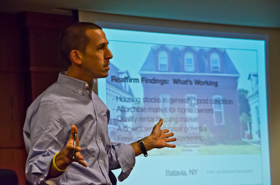

By Yaël Ossowski | September 25, 2015 | [Watchdog.org](http://watchdog.org/239753/erie/)

The city of Erie is in desperate times, and a consultant hired to map a positive future isn’t optimistic.

“The plan I am trying to write is a plan to get the city out of the hole it is in,” Charles Buki told Watchdog.org.

An urban architect — and miracle worker of sorts — Buki and his colleagues from the urban [planning firm CZB](https://www.google.at/url?sa=t&rct=j&q=&esrc=s&source=web&cd=1&cad=rja&uact=8&ved=0CB8QFjAAahUKEwjLxOCztpDIAhWJuBQKHeviDIs&url=http%3A%2F%2Fwww.czb.org%2F&usg=AFQjCNF2hwtzVMxU8FvIwQAjXYNevNLn2A) are brought into cities with stressed finances and lackluster infrastructure. They’ve had [big contracts](http://czb.org/about/clients/) with the Fannie Mae Foundation, the Metropolitan Planning Council of Chicago, the Federal Reserve Bank, Bowling Green, Ohio, and Stockton, California, one of the first American cities to declare bankruptcy.

When asked about the priority of mitigating climate change, which was mentioned in the background analysis on the city written by another firm, Buki laughed.

“Climate change? Seriously? Absolutely not. The city is broke,” he said.

For a contract of more than [$100,000](http://watchdog.org/238762/comprehensive-plan/), the city hired the firm in February to craft a 10-year comprehensive plan to address the vital issues it must address to stay afloat.

“There’s about a million pressing items of some urgency in Erie, as is the case in all such post industrial basket cases,” he said, mentioning Detroit, Buffalo and Cleveland, which have struggled to regain their former glory as urban powerhouses that attracted industry and jobs.

[RELATED: Erie’s 10-year ‘comprehensive plan’ consultants cost over $100,000](http://watchdog.org/238762/comprehensive-plan/)

As in those cities, Erie has struggled with a diminished industrial base, lower population and a strained tax base.

“They have, in my view, a real problem on this front that’s two-fold,” said Buki. “On one hand they have a lot of issues that require attention with urgency. On the other, they have neither the money nor the will to agree on and choose which ones they want to tackle first.”

In [previous interviews](http://watchdog.org/238762/comprehensive-plan/), Buki mentioned the issues of housing development and revamping the downtown area. But with such a lack of funds and a shrinking tax base, it’s not certain exactly how such plans would come to fruition.

Erie’s redevelopment executive Kim Greene could not be reached for comment.

As required by state law, a municipal comprehensive plan must be drawn up with input from local leaders.

In Erie it will be crafted in consultation with the s[teering committee](http://www.erie-comprehensive-plan.org/about-the-committee/), made up of local business and government leaders. Each committee member was selected by the local Department of Community and Economic Development to serve as a volunteer throughout the process.

The plan is expected to be completed by the end of winter 2016.
